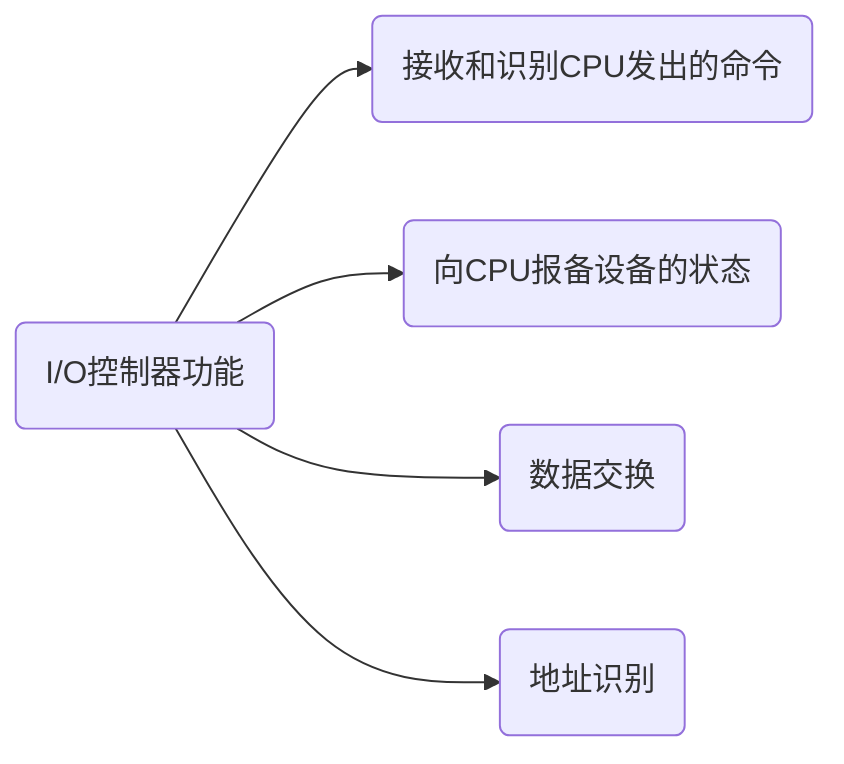
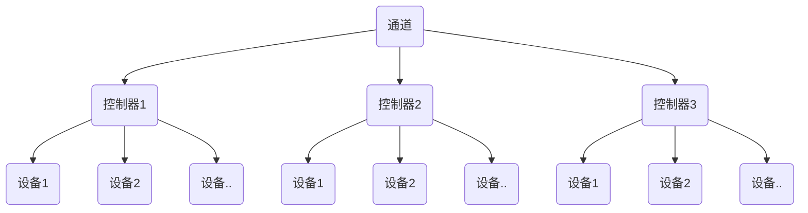

### I-O设备概念和分类

操作系统作为系统资源管理者，提供的功能（处理机管理、存储器管理、文件管理、设备管理-I/O），目标是安全高效

设备管理 - 主机外部设备的管理

##### 什么是I/O设备

外部设备

I/O == Input/Output == 输入/输出

I/O设备就是将数据输入到计算机，或者可以接收计算机输出的外部设备，属于计算机中的硬件部件

鼠标、键盘是典型的输入型设备，显示器是典型的输出型设备，移动硬盘/U盘即可以是输入也可以是输出型设备。

UNIX系统会把外部设备抽象成特殊的文件，用户可以使用与文件操作相同的方式对文件进行操作。

WRITE操作：向外部设备写出数据

READ操作：从外部设备读入数据

##### 使用特性分类

①人机交互类外部设备

人机交互外设，鼠标、键盘、打印机---用于人机交互。

数据传输速度较慢以字节/几十字节为单位的。

②存储设备

移动硬盘、光盘等---用于数据存储

数据传输速度快

③网络通信设备

调制解调器等---用于网络通信

数据传输速度介于人机交互类与存储设备之间

##### 传输速率分类

低速设备：传输速率在每秒几字节～几百字节

中速设备：传输速率在每秒几千～上万字节

高速设备：传输速率在每秒千兆字节

##### 信息交互单位分类

块设备：数据传输地基本单位是块--传输速率较高、可寻址，即对它可以随机地读/写任一块

字符设备：数据传输地基本单位是字符--传输速率较慢，不可寻址，输入输出时常采用中断驱动方式


### I-O控制器

I-O设备分为机械部件、电子部件（I/O控制器、设备控制器）

I-O设备的<span style="color:red">机械部件</span> 主要用来执行具体I/O操作

I-O设备的<span style="color:red">电子部件</span> 通常是一块插入主板扩充槽的印刷电路板

操作系统 -- 电子部件 -- 机械部件

##### I-O电子部件

I/O控制器

CPU无法直接控制I-O设备的机械部件，因此I/O设备需要一个电子部件作为CPU和I/O设备机械部件之间的“中介”，用于实现CPU对设备的控制。



I/O控制器中会有相应的<span style="color:red">控制寄存器</span> 来存放命令和参数

I/O控制器中会有相应的<span style="color:red">状态寄存器</span> 用于记录I/O设备当前的状态，如1表示空闲，0表示忙碌

I/O控制器中会有相应的<span style="color:red">数据寄存器</span>，输出时，数据寄存器用于暂存CPU发来的数据，之后再由控制器传送设备。输入时，设备寄存器用于暂存设备发来的数据，之后CPU从数据寄存器中取走数据。

类似于内存的地址，为了区分设备控制器中的各个寄存器，也需要给各个寄存器设置一个特定的“地址”，I/O控制器通过CPU提供的地址来判断CPU要读/写那个寄存器。


##### I-O控制器组成

CPU与控制器的接口、I-O逻辑、控制器与设备的接口

I-O逻辑：负责接收和识别CPU的各种指令（如地址译码），并负责对设备发出命令。发现一个I-O控制器可能有多个控制器与设备接口

CPU --控制线（发出I/O指令） --> I-O逻辑

CPU --地址线（要操作那一个设备） --> I-O逻辑

CPU --数据总线 --> I-O控制器的数据寄存器

CPU --数据总线 （数据参数）--> I-O控制器的数据寄存器

 I-O逻辑 -- 读取 <--  I-O控制器的数据寄存器(数据参数)

CPU -- 读出各个设备状态 <-- I-O控制器的状态寄存器【忙碌、空闲、故障等】

 => CPU与控制器的接口：用于实现CPU与控制器之间的通信。CPU通过控制线发出命令，通过地址线指明要操作的设备，通过数据线来取出（输入）数据，或放入（输出）数据

控制器与设备的接口 -- 数据、状态、控制（控制器向设备发出控制信息） -- I-O逻辑 -- CPU与控制器的接口

=> 控制器与设备的接口：用来实现控制器与设备之间的通信


【注意】①一个I-O控制器可能会对应多个设备。②数据寄存器、控制寄存器、状态寄存器可能有多个（如：每个控制/状态寄存器对应一具设备），且这些寄存器都要有响应的地址，才能方便CPU操作。有的计算机会让这些寄存器占用内存地址的一部分，称为<span style="color:red">内存映像I/O</span> ；另外一些计算机采用I/O专用地址，即<span style="color:red">寄存器独立编址</span> 。

内存映像vs独立编址

内存映射I/O。控制器中的寄存器与内存地址统一编址。优点，简化了指令，可以采用对内存的操作指令来对控制进行操作。

寄存器独立编址。控制器中的寄存器使用单独编址。缺点，需要设置专门的指令来实现对控制器的操作，不仅仅要指明寄存器的地址，还要指明控制器的编号。


### I-O控制方式

I-O控制器对I-O的控制方式，用什么样的方式来控制I-O设备对数据的读写

各种控制方式需要注意的问题：1，完成一次读/写操作的流程；2，CPU干预的频率；3，数据传送的单位；4，数据的流向；5，主要缺点和优点

##### 程序直接控制方式

最早期的控制方式

<span style="color:red">key word：轮询</span> 

🍎 1，完成一次读/写操作的流程（以<span style="color:red">读操作</span>为例 ）

①CPU向控制器发出读指令。于是设备启动，并且状态寄存器设置为1（未就绪）

②CPU轮询检查控制器的状态（其实就是不断地执行程序的循环，若状态寄存器一直为1，说明设备还未准备好要输入数据，于是CPU会不断地轮询）

③输入设备准备好数据后将数据传给I-O控制器并报告自身状态

④I-O控制器将输入的数据放到数据寄存器中，并将状态改为0（已就绪）

⑤CPU发现设备已就绪，即可将数据寄存器中的内容读入CPU的寄存器中，在把CPU寄存器中的内容放入内存

⑥若还要继续读入数据，则CPU继续发出下一条读指令 --->①

对应的流程图为

 CPU --> I-O控制器(给I-O模块发出读命令)【CPU向控制器发出命令】

I-O控制器 --> CPU(读I-O模块状态)【将I-O状态信息读入CPU寄存器】

检查状态【设备可能会出错】

I-O --> CPU(从I-O模块中读取字)【将数据寄存器中的内容读入CPU寄存器】

CPU --> 存储器(往存储器中写入字)【将CPU寄存器中的内容写到内存】

```c
#include<stdio.h>
#include<stdlib.h>
int main(){
  int a,b,c,d;
  scanf("%d",&a);
  scanf("%d",&b);
  printf("a+b=%d",a+b);
  system("pause");
  return 0;
}
```

=> 输入的数据最终要放到内存中（a,b,c,d变量存放在内存中），同理输出的数据也存放在内存中，需要从内存中取出。

🍎2，CPU干预的频率

CPU需要不断地轮询检查这个I-O操作是否已经完成 => CPU干预很频繁，I-O操作开始之前、完成之后需要CPU介入，并且<span style="color:red">在等待I/O完成的过程中CPU需要不断地轮询检查</span> 。-- 程序直接控制方式最大的缺点。

🍎3，数据传输单位

每次读入/写出的单位是<span style="color:red">一个字</span> 

🍎4，数据流向

读操作（数据输入）：I-O设备 --> CPU --> 内存

写操作（数据输出）：内存 --> CPU --> I-O设备

CPU指代CPU寄存器

🍎5，主要优点与缺点

优点：实现简单。在读/写指令之后，加上实现循环的一系列指令即可--用软件的方式即可实现（因此才称为“程序直接控制方式”）

缺点：<span style="color:red">CPU 和I-O设备只能串行工作，CPU需要一直轮询检查，长期处于“忙等状态”</span>，CPU利用率低。I-O设备的利用率也低。

##### 中断驱动方式

 CPU --> I-O控制器(给I-O模块发出读命令)【CPU向控制器发出命令】

---------------------->做其他事情、中断<-----------------------

I-O控制器 --> CPU(读I-O模块状态)【将I-O状态信息读入CPU寄存器】

引入<span style="color:red">中断机制</span>。由于I/O设备速度很慢，因此在CPU发出读/写命令后，可将<span style="color:red">等待I/O的进程阻塞</span> ，先切换别的进程执行。当I/O完成后，控制器会向CPU发出一个中断信号，CPU <span style="color:red">检测到中断信号后</span> ，会保存当前进程的运行环境，转去处理中断处理程序处理该中断。处理中断过程中，CPU从I-O控制器读一个字的数据传送到CPU寄存器，再写入主存。接着，<span style="color:red">CPU恢复等待I-O的进程（或其他进程）的运行环境，然后继续执行</span> 。

注意：

①CPU会在每个指令周期的末尾检查中断；

②中断处理过程中需要保存、恢复进程的运行环境，这个过程是需要一定时间开销的。可见如果中断发送频率过高，也会降低系统性能。

<span style="color:red">key word：中断</span> 

🍎 1，完成一次读/写操作的流程（以<span style="color:red">读操作</span>为例 ）

同程序直接控制方式

🍎2，CPU干预的频率

每次I-O操作开始之前，完成之后需要CPU介入

<span style="color:red">等待I-O完成的这个过程中CPU可以切换到别的进程中执行</span> ，实现CPU与I-O设备并行工作的方式

🍎3，数据传输单位

每发出一个读/写指令，每次读入/写出<span style="color:red">一个字</span> 

🍎4，数据流向

读操作（数据输入）：I-O设备 --> CPU --> 内存

写操作（数据输出）：内存 --> CPU --> I-O设备

🍎5，主要优点与缺点

中断驱动的主要优点：与“程序直接控制方式”相比，在“中断驱动方式中”，I/O控制器会通过中断信号主动报告I/O已完成，CPU不再需要不停地轮询，<span style="color:red">CPU和I-O设备可并行工作</span> ，CPU利用率得到明显提升。

缺点：每个字在I-O设备与内存之间传输，都需要经过CPU。而<span style="color:red">频繁地中断处理会消耗较多的CPU时间</span> 。


##### DMA方式

与“中断驱动方式”相比，DMA方式（Direct Memory Access，<span style="color:red">直接存储器读取</span>，主要用于块设备的I-O控制）有这样几个改进。

① <span style="color:red">数据传送的单位是块</span> ，不再是一个字一个字地传送

② 数据的流向不再经过CPU，是从设备直接到内存，或者从内存直接到设备。

③ 仅在传送一块或多块的开始和结尾是才需要CPU干预，干预频率进一步降低。

MDA方式的主要流程：
CPU --> DMA 给I-O模块发出读块指令 --> CPU 做其他事情

DMA --> CPU 读DMA模块的状态，中断

下一条指令

CPU指明此次要进行的操作，（如读操作）并说明要读入多少条数据，数据要存放在内存的什么位置，数据在外部设备的地址（如磁盘的地址），DMA 控制器会根据CPU提出的要求完成数据的读写工作，整块数据的传输完成后，才向CPU发出中断信号。

DMA控制器也是一种I-O控制器，DMA控制器由三个部分组成。主机（CPU）-- 控制器接口、I-O控制逻辑、块设备 -- 控制器接口，和I-O控制器一一对应，CPU通过系统总线来读写DMA控制器中某些寄存器中的内容，从而控制DMA控制器。

DR（Data Register，数据寄存器）:暂存从设备到内存，或从内存到设备的数据。

MAR（Memory Address Register，内存地址寄存器）：在数据输入时，MAR表示数据应放到内存中的什么位置，输出时，表示输出的数据放在了内存中的什么位置。

DC（Data Counter，数据计数器）：表示剩余要读/写的字节数

CR（Command Register，命令/状态寄存器）：用于存放CPU发送过来的I-O命令，或设备的状态信息。

系统总结会把CPU、内存、DMA连接在一起 => 设备可以和内存直接通信

【注意】DMA控制器并不是一次读入一整块的数据放到内存当中，其实从磁盘到DMA （DR）再到内存中也是一个字一个字读入的

<span style="color:red">key word：</span> 

🍎 1，完成一次读/写操作的流程（以<span style="color:red">读操作</span>为例 ）

CPU --> DMA 给I-O模块发出读块指令 --> CPU 做其他事情

DMA --> CPU 读DMA模块的状态，中断

🍎2，CPU干预的频率

进一步降低，仅在传送一个或多个数据块的开始和结束时，才需要CPU干预

🍎3，数据传输单位

每次读/写<span style="color:red">一块或多块（注意这里每次读写只能是连续的多个块，且这些块读入内存后在内存中也必须是连续的）</span> 

如果是操作多个离散的块，则需要CPU发出多次的I-O指令

🍎4，数据流向（<span style="color:red">不再需要经过CPU</span> ）

读操作（数据输入）：I-O设备  --> 内存

写操作（数据输出）：内存 --> I-O设备

🍎5，主要优点与缺点

优点：数据以块为单位，CPU介入频率进一步降低，数据的传输不再需要经过CPU再写入内存，数据传输效率进一步增加。CPU与I-O设备的并行性能得到提升。

<span style="color:red">缺点</span> ：CPU只发出一条指令，只能读写一个或多个连续的数据块。


##### 通道控制方式

解决DMA CPU只发出一条指令，只能读写一个或多个连续的数据块。如果是操作多个离散的块，则需要CPU发出多次的I-O指令。

<span style="color:red">通道</span>：是一种<span style="color:red">硬件</span> ，可以理解为<span style="color:red">弱鸡版本的CPU</span> ，通道可以识别并执行一系列<span style="color:red">通道指令</span> 。

CPU -- 内存 -- 通道 （硬件）｜ I-O设备块1、I-O设备块2

① CPU向通道发出I/O指令，指明通道程序/通道序列在内存中的位置，并指明要操作的那个I/O设备，之后CPU就切换到其他程序执行了

②通道执行内存中的通道程序（通道任务清单/通道指令的集合）（其中指明要读入/写出多少数据，读/写的数据应存放在内存中的什么位置等信息）

③通道执行完规定任务之后，向CPU发出中断信息，之后CPU对中断信息进行处理。

弱鸡版本的CPU：与CPU相比，通道执行的指令很单一，并且通道程序是放在主机内存中的，也就是通道与CPU共享内存。

<span style="color:red">key word：</span> 

🍎 1，完成一次读/写操作的流程（以<span style="color:red">读操作</span>为例 ）

CPU给通道发出指令 -- CPU做其他事情，通道自主完成I-O

CPU进行中断处理 -- 通道发出的中断信号

执行后续操作

🍎2，CPU干预的频率

引入通道之后，CPU的干预频率变得极低，通道会根据CPU的指示执行相应的通道程序，只有完成一组数据块的读/写操作后才需要发出中断信号，请求CPU干预

🍎3，数据传输单位

每次读/写<span style="color:red">一组数据块</span> 

🍎4，数据流向（<span style="color:red">在通道控制下进行</span> ）

读操作（数据输入）：I-O设备  --> 内存

写操作（数据输出）：内存 --> I-O设备

🍎5，主要优点与缺点

缺点：实现复杂、需要专门的通道硬件支持

<span style="color:red">优点：CPU、通道、I-O设备可并行工作，资源利用率高</span> 

##### 回顾

程序直接控制方式--> 中断驱动方式 --> DMA方式 --> 通道控制方式，每个阶段的优点都是解决上一个阶段最大的缺点，总体来说，整个发展过程要尽量减少CPU对I-O过程的干预，把CPU从繁杂的I-O控制事务中解放出来，以便更多地完成数据处理的任务。


### I-O软件层次结构

I-O软件层次理解的线索： 从I-O请求到I-O应答

从I-O请求 ----------------------------------------------------------------------------------------------------->

用户软件层次 -- 设备独立性软件层次 -- 设备驱动程序 -- 中断处理程序 -- 硬件

<-----------------------------------------------------------------------------------------------------------I-O应答

硬件，即I-O设备硬件，由机械部分和电子部分组成。

设备独立性软件层次 -- 设备驱动程序 -- 中断处理程序这三层属于操作系统内核部分即"I-O系统，或称为I-O核心子系统"

越上面层越接近用户，越下面层越接近硬件，每一层会利用下一层提供的服务，实现某些功能，并屏蔽实现的具体细节，向高层提供服务（“封装思想”）

##### 用户层软件

用户层软件<span style="color:red">实现了与用户交互的接口</span> ，用户可直接使用该层提供的、与I-O操作有关的库函数对设备进行操作。

Eg：

```c
printf("hello world!");
```

库函数 --call--> 系统调用接口（设备独立性软件向上层提供的系统调用接口）--> 设备独立性软件处理系统调用 （系统调用处理层）

用户层软件将用户请求翻译成格式化的I-O请求，并通过系统调用请求操作系统内核服务

Eg: printf("hello world!")会被翻译成等价的write系统调用，当然用户软件也会在系统调用时填入相应的参数

Windows API是windows软件向用户提供给用户调用的库函数。

##### 设备独立性软件

<span style="color:red">设备独立性软件</span> 又称为<span style="color:red">设备无关性软件</span> 。与设备的硬件特性无关的功能几乎都在这一层实现。

实现的主要功能：

① 向上层提供统一的系统调用接口（如write/read系统调用）

② 实现设备的保护，原理类似于文件保护。设备被看作一种特殊的文件，不同用户对文件的访问权限不一样，同理对设备的访问权限不一样

③差错处理，设备独立性软件需要对一些设备的错误进行处理，差错的类型比较多，不需要进行深刻的认识

④设备的分配与回收，很多设备是一种临界资源，不可以分配给多个进程使用

⑤数据缓冲区管理，可以使用缓冲技术屏蔽设备之间数据交换单位大小和传输速度之间的差异

⑥建立逻辑设备名到物理设备名之间的映射关系：根据设备类型选择调用相应的驱动程序

逻辑设备名：用户在请求设备时提供的名字比如打印机1、打印机2。<span style="color:red">设备独立性软件</span>需要通过<span style="color:red">逻辑设备表LUT(Logic Unit Table)</span>来确定逻辑设备对应的<span style="color:red">物理设备</span>   ，并找到该设备对应的<span style="color:red">设备驱动程序</span> 

LUT每个表项会记录每个设备驱动程序的入口地址

| 逻辑设备名  | 物理设备名 | 驱动程序入口地址 |
| ----------- | ---------- | ---------------- |
| /dev/print1 | 3          | 1024             |
| /dev/print2 | 5          | 2046             |
| ...         | ...        | ...              |

I-O设备被当作一种特殊的文件，不同类型的I-O设备需要不同的驱动程序处理

操作系统可以采用两种方式来管理逻辑设备表LUT

第一种方式：<span style="color:red">整个系统只设置一张表</span> ，这就意味着所有用户不能使用相同的设备名，因此这种操作只适合单用户操作系统。

第二种方式：<span style="color:red">为每个用户单独设置一张表</span> ，各个用户使用的逻辑设备名可以重复，适用于多用户操作系统，系统会在用户登陆时为其建立一个用户管理进程，而LUT就放在用户管理进程的PCB中。

类似于单级目录和两级目录

思考：不同类型的I-O设备需要不同的设备驱动程序？

不同设备，外形不同，其内部电子部件（I-O控制器）也有可能不同，不同设备硬件的内部特性不同，这些特性只有厂家知道，因此厂家需要提供与设备相应的驱动程序，CPU执行驱动程序的指令序列，来完成设置设备寄存器，检查设备状态等工作。

=> 设备独立性软件不能直接操作硬件，需要调用厂家提供的设备驱动程序，有设备驱动程序来完成对硬件的具体控制。

##### 设备驱动程序

主要负责对硬件设备的具体控制，将上层发出的一系列命令（如read/write）转换成特定设备“能听懂”的一系列操作，包括设置设备寄存器，检查设备状态等。

驱动程序一般以一个独立的进程的方式存在

##### 中断处理程序

当硬件设备完成I-O任务时，I-O控制器会发送一个<span style="color:red">中断信号</span> ，系统会根据<span style="color:red">中断信号类型</span> 找到相应的<span style="color:red">中断处理程序</span> 并执行，中断处理程序的流程如下

从控制器中读出设备状态 -->I/O正常结束 --> 否，根据异常原因做相应处理

--> 是，从设备中读入一个字的数据并经由CPU放到内存缓冲区中

可见中断处理程序也会和硬件直接打交道

##### 硬件

具体执行I-O操作的部件


### I-O核心子系统

设备独立性软件层次 -- 设备驱动程序 -- 中断处理程序属于操作系统的内核部分，即<span style="color:red">I-O系统</span> ，或称为<span style="color:red">I-O核心子系统</span> 。

I-O核心子系统要实现的功能就是中间这三层要实现的功能

重点掌握I-O调度、设备保护、假脱机技术（SPOOLing技术）、设备分配与回收、缓冲区管理（缓冲与高速缓存）

##### 功能所在层次实现

假脱机技术（SPOOLing技术）-- 用户层实现

<span style="color:red">I-O调度、设备保护</span> 设备分配与回收、缓冲区管理（缓冲与高速缓存） -- 设备独立性软件层实现

【注】假脱机技术都需要使用到磁盘这种设备的设备独立性软件提供的服务，因此一般来说假脱机技术是在用户层软件实现的。

<span style="color:red">I-O调度</span> ：<span style="color:red">用某种算法确定一个好的顺序来处理各种I-O请求</span> 

如磁盘调度（先来先服务算法、最短寻道优先算法、SCAN算法、C-SCAN算法、LOOK算法、C-LOOK算法），当多个磁盘I-O请求来时，用某种调度算法确定满足I/O请求的顺序。

磁盘是一种I-O设备，磁盘调度也是一种I-O调度问题，还有打印机、等

<span style="color:red">设备保护</span> ：操作系统需要实现<span style="color:red">文件保护功能</span> ，不同的用户对各个文件有不同的访问权限（如只读、写、读和写）


### 假脱机技术

SPOOLing技术

##### 什么是脱机技术

CPU处理很快，但是数据输入和数据输出很慢

批处理阶段引入了<span style="color:red">脱机输入/输出技术</span> （用磁带完成）

在外围控制机的控制下，慢速输入设备的数据先被输入到更快速的磁带上。之后主机可以从快速的磁带上读入数据，从而缓解了矛盾

##### 脱机技术实现原理

脱机：脱离主机控制进行的输入输出操作 -- 外围控制机实现，缓解CPU、I-O设备速度矛盾之外，CPU - 磁带 - 输入/输出设备的执行具有非强相关性。

<span style="color:red">假脱机技术</span> ，又称<span style="color:red">SPOOLing技术</span> ，是用软件的方式模拟脱机技术。SPOOLing系统组成如下

系统在磁盘上开辟两个存储区域 -- “输入井，输出井”

输入井模拟脱机输入时的磁带，用于收容I-O设备输入的数据

输出井模拟脱机输出时的磁带，用于收容用户进程输出的数据

输入进程和输出进程组成了外围控制机，输入进程模拟脱机输入，输出进程模拟脱机输出。输入进程、输出进程要和用户进程并发地执行才能模拟脱机输入和脱机输出的整个过程。SPOOLing技术又多道程序技术的支持。

【注】输入缓冲区和输出缓冲区是在内存中的缓冲区，作用是在模拟脱机输入输出时，用于暂存输入/输出数据，之后再转到输入井或设备中。

##### 共享打印机原理分析

独占式设备 -- <span style="color:red">只允许各个进程串行使用设备</span> ，一段时间内只能满足一个进程请求。

共享设备 -- <span style="color:red">允许多个进程同时使用设备</span>（宏观上同时使用，微观上可能是交替使用），可以同时满足多个进程的使用请求。

打印机是一种独占式的设备，但是使用了假脱机技术改造成共享设备

独占式的例子：一个进程正在使用打印机，另一个进程请求打印机时必然阻塞等待。

多个用户提出输出打印请求时，系统会先答应他们的请求，但并不是真正把打印机分配给他们，而是由假脱机管理进程为每个进程做两件事情：

①在磁盘的输出井中为进程申请一个空闲缓冲区（也就是这个缓冲区是在磁盘上的），并将要打印的数据送入其中。

②为用户进程申请一张空白的打印申请表，并用户的打印请求填入表中（其实就是用来说明用户打印的数据存放位置等信息）再将该表挂到假脱机文件队列上。

假脱机文件队列 == 打印人物队列

打印机空闲时，输出进程会从文件队列队头取一张打印申请表，并根据表中的要求将要打印的数据从磁盘的缓冲区（输出井），从输出井传送到内存的输出缓冲区，再输出到打印机进行打印。

用这种方式可依次处理完全部打印任务

SPOOLing技术可以把一台物理设备<span style="color:red">虚拟</span>成逻辑上的多台设备，<span style="color:red">可将独占式设备改造成共享设备</span>  


### 设备的分配与回收

##### 考虑因素

考虑设备固有属性、设备的分配算法、设备分配中的安全性

设备固有属性分为：<span style="color:red">独占设备</span> （一个设备一段时间段内只能分配给一个进程的设备、如打印机）、<span style="color:red">共享设备</span> （可同时分配给多个进程使用、如磁盘，各个进程往往宏观上同时共享使用设备，而微观上交替使用）、<span style="color:red">虚拟设备</span> （采用SPOOLing技术将独占设备改造成虚拟的共享设备，可同时分配给多个进程使用、如采用SPOOLing技术实现的共享打印机）

设备的分配算法：先来先服务算法、优先级高者优先算法、短任务优先算法

设备分配的安全性：从进程运行的安全性上考虑，设备分配有两种方式。

<span style="color:red">安全分配方式</span> ：为进程分配一个设备后就将进程阻塞，本次I/O完成后才将进程唤醒（eg:考虑进程请求打印机打印输出的例子）。采用安全分配方式一段时间内每个进程只能使用一个设备。优点：破坏了“请求和保持”条件，不会死锁；缺点：对于一个进程来说，CPU和I/O设备只能串行工作，系统资源利用率低，运行效率也低。

<span style="color:red">不安全分配方式</span> ：进程发出I/O请求，系统为其分配I/O设备，进程可继续执行，之后还可以发出新的I/O请求。只有某个I/O请求得不到满足时才将进程阻塞。采用不安全分配方式，一个进程可以同时使用多个设备。优点：进程计算任务和I/O任务可以并行处理，使进程迅速推进；缺点：有可能发生死锁（死锁避免，死锁的检测和解除）。

##### 静态、动态分配

静态分配：进程运行前为其分配全部所需资源（破坏了请求和保持条件，不会发生死锁），没有分配好全部所需资源是不会运行进程的，运行结束后归还资源。

动态分配：进程运行过程中动态分配设备资源。

##### 数据结构

设备、控制器、通道之间的关系：一个通道控制多个控制器、一个控制器控制多个设备 --- 1:n:mn




【注】一个系统包含有多个通道

<span style="color:red">设备控制表DCT</span>:为每个设备配置一张DCT，用于记录设备使用情况

|   设备控制表DCT    | ...                                                          |
| :----------------: | ------------------------------------------------------------ |
|      设备类型      | 如打印机、扫描仪、键盘、鼠标                                 |
|     设备标识符     | 即物理设备名，系统中每个设备的物理设备名唯一                 |
|      设备状态      | 忙碌/空闲/故障...                                            |
| 执行控制器表的指针 | 每个设备由一个控制器控制，该指针指可以找到相应的控制器信息   |
| 重复执行次数或时间 | 当重复执行多次I/O操作不成功后，才认为此I/O操作不成功（该字段记录失败了几次） |
| 设备队列的队首指针 | 指向正在等待该设备的进程队列（由进程PCB组成队列）            |

【注】进程管理中有，系统会根据阻塞原因不同，将进程PCB挂到不同的阻塞队列中。

<span style="color:red">控制器控制表COCT</span> :每个设备控制器对应一张COCT，操纵系统会根据COCT的信息对控制器进程操作和管理

|   控制器控制表COCT   | ...                                                      |
| :------------------: | -------------------------------------------------------- |
|     控制器标识符     | 各个控制器唯一ID                                         |
|      控制器状态      | 忙碌/空闲/故障...                                        |
|   指向通道表的指针   | 每个控制器由一个通道控制，该指针可以找到相应的通道信息   |
| 控制器队列的队首指针 | 指向正在等待该控制器的进程队列（由进程PCB组成队列）-队首 |
| 控制器队列的队尾指针 | 同上--队尾                                               |

<span style="color:red">通道控制表CHCT</span>: 每个通道对应一张CHCT，操作系统会根据CHCT的信息对通道进行操作和管理

|       通道控制表CHCT       | ...                                                          |
| :------------------------: | ------------------------------------------------------------ |
|         通道标识符         | 各通道的唯一ID                                               |
|          通道状态          | 忙碌/空闲/故障..                                             |
| 与通道连接的控制器表首地址 | 可以通过该指针找到该通道所管理的所有控制器的相关信息（COCT） |
|     通道队列的队首指针     | 指向正在等待该通道的进程队列（由进程PCB组成队列）-队首       |
|     通道队列的队尾指针     | 同上--队尾                                                   |

<span style="color:red">系统设备表SDT</span> :记录了<span style="color:red">系统中全部设备的情况</span> ，每个设备对应一张表目

| 系统设备表SDT | ...  |
| ------------- | ---- |
| 表目1         | ...  |
| 表目2         | ..   |

|                     表面i                      | ...                |
| :--------------------------------------------: | ------------------ |
|                    设备类型                    | 打印机/扫描仪/键盘 |
|                   设备标识符                   | 物理设备名         |
| <span style="color:red">DCT(设备控制表)</span> | Xxxx               |
|                  驱动程序入口                  | Xxxxx              |


##### 分配的步骤

①根据进程请求的<span style="color:red">物理设备名</span>查找SDT(注：物理设备名是进程请求分配设备时提供的参数)

②根据SDT找到DCT，若<span style="color:red">设备忙碌</span> 则将进程PCB挂到<span style="color:red">设备等待队列</span>中，不忙碌则将设备分配给进程。

③根据DCT找到COCT，若<span style="color:red">设备控制器忙碌</span> ，则将进程PCB挂到<span style="color:red">控制器等待队列</span> 中，不忙碌则将控制器分配给进程。

④根据COCT找到CHCT，若<span style="color:red">通道忙碌</span> ，则将进程PCB挂到<span style="color:red">通道等待队列</span> 中，不忙碌则将通道分配给进程。

<span style="color:red">[注]：只有设备、控制器、通道三者都分配成功时，这次设备分配才算成功，之后便启动I/O设备进行数据传送。</span> 

##### 改进方法

缺点：⑴用户编程时必须使用“物理设备名”，底层细节对用户不透明，不方便编程；⑵若换了一个物理设备，则程序无法进行；⑶若进程请求的物理设备处于忙碌状态，则即使系统中还有同类型的设备，进程也必须阻塞等待。

改进方法：建立逻辑设备名与物理设备名的映射机制，用户编程时只需提供逻辑设备名，下面是改进后的分配步骤

①根据进程请求的<span style="color:red">逻辑设备名</span>查找SDT(注：<span style="color:red">用户编程时提供的逻辑设备名其实就是"设备类型"</span> )

②查找SDT，找到用户进程<span style="color:red">指定类型的、并且空闲</span>的设备，将其分配给该进程。操作系统<span style="color:red">再逻辑设备表（LUT）中新增一个表项</span>  

| 系统设备表SDT | ...  |
| ------------- | ---- |
| 表目1         | ...  |
| 表目2         | ..   |

|                     表面i                      | ...                                       |
| :--------------------------------------------: | ----------------------------------------- |
|                    设备类型                    | <span style="color:red">逻辑设备名</span> |
|                   设备标识符                   | 物理设备名                                |
| <span style="color:red">DCT(设备控制表)</span> | Xxxx                                      |
|                  驱动程序入口                  | Xxxxx                                     |

| 逻辑设备名  | 物理设备名 | 程序驱动入口 |
| ----------- | ---------- | ------------ |
| /dev/打印机 | 3          | 1024         |
| /dev/扫描仪 | 5          | 2046         |
| ...         | ...        | ...          |

③根据DCT找到COCT，若设备控制器忙碌，则将进程PCB挂到控制器等待队列中，不忙碌则将控制器分配给进程。

④根据COCT找到CHCT，若通道忙碌 ，则将进程PCB挂到通道等待队列 中，不忙碌则将通道分配给进程。

<span style="color:red">逻辑设备表LUT建立了逻辑设备名与物理设备名之间的映射关系</span> 

某用户进程第一次使用设备时使用逻辑设备名向操作系统发送请求，操作系统根据用户进行提供的设备类型（逻辑设备名）查找设备表，找到一个空闲设备表分配给进程，并在LUT中增加相应表项。

<span style="color:red">如果之后用户进程再次通过相同的逻辑设备名请求使用设备，则操作系统功过LUT表即可知道用户进程实际要使用的是那个物理设备，并且也能知道该设备的驱动程序入口地址</span> 。

逻辑设备表的设置问题：

整个系统只有一张LUT，各用户所用的<span style="color:red">逻辑设备名不允许重复</span>，适用于单用户操作系统。

每个用户一张LUT，<span style="color:red">不同用户的逻辑设备名可以重复</span>  ，适用于多用户操作系统。


### 缓冲区管理

##### 定义、作用

缓冲区是一个存储区域，可以由专门的硬件寄存器组成，也可以利用内存作为缓冲区

<span style="color:red">使用硬件作为缓冲区的成本高、容量较小</span>，一般仅用在对速度要求非常高的场合（如存储器管理中用到的联想寄存器-块表，对页表的访问频率极高，因此使用联想寄存器来存放页表项的副本）

 一般情况下，更多的是利用<span style="color:red">内存作为缓冲区</span> ，“设备独立性软件”的缓冲区管理就是要管理好这些缓冲区。

本章主要讲内存缓冲区

缓冲区作用：缓和CPU与I/O设备之间速度不匹配的矛盾；减少对CPU的中断频率，放宽对CPU中断相应的时间限制；解决数据粒度不匹配的问题；提高CPU与I/O设备之间的并行性。

CPU -------------------------------->内存【缓冲区】<----------------------------I/O设备

CPU要把输出的数据快速地放入缓冲区，只有就可以做别的事情了

慢速的I/O设备可以慢慢地从缓冲区中取走数据。数据输入时也是类似的

输出进程每次可以生成一块数据，单I/O设备每次只能输出一个字符

CPU  <------------------------------------------------------------------------------------->I/O设备

如果是字符型设备，则每输入完一个字符就要向CPU发送一次中断请求。中断时需要一定的时间代价的

##### 单缓冲

假设用户进程请求某种块设备读入若干块数据。若采用<span style="color:red">单缓冲</span> 策略，操作系统会<span style="color:red">在主内存中为其分配一个缓冲区</span> （若题目中没有说明，一个缓冲区的大小就是一个块）

<span style="color:red">注意：当缓冲区数据非空时，不能往缓冲区充入数据，只能从缓冲区把数据传出；当缓冲区数据为空时，可以往缓冲区充入数据，但必须把缓冲区充满后，才能从缓冲区把数据传出。</span> 

CPU处理耗时C<-----------------用户进程工作区<-----传送耗费时间M-----内存【缓冲区】<------输入(块)、耗费时间T ------块设备

用户进程的内存空间中，会分配一片工作区来接收输入/输出数据（一般也默认工作区的大小与缓冲区相同）

考：计算每处理一块数据平均需要多久？

技巧：假定一个初始状态，分析下次到达相同状态需要多少时间，这就是处理一块数据平均所需时间。

在“单缓冲”题当中，可以假设初始状态为工作区满，缓冲区空。

<span style="color:red">假设T > C</span> ，因此CPU处理完数据后暂时不能将下一块数据传送到工作区，必须等待缓冲区中充满数据。

=> 处理一块数据的平均用时为T+M(缓冲区数据填满)

<span style="color:red">假设T < C</span>，因此缓冲区中充满数据后暂时不能继续冲入下一块数据，必须等待CPU结束将数据从缓冲区传送到工作区。

 => 处理一块数据的平均用时为C+M(缓冲区数据取空)

<span style="color:red">结论：采用单缓冲区策略，处理一块数据平均耗时Max(C,T)+M</span> 

##### 双缓冲

假设某用户进程请求某种设备读入若干块数据。若采用<span style="color:red">双缓冲</span>策略，操作系统会<span style="color:red">在主存中为其分配两个缓冲区</span>  （若题目中没有说明，一个缓冲区的大小就是一个块）

双缓冲区题目中，假设初始状态为：<span style="color:red">工作区空，其中一个缓冲区满，另一个缓冲区空</span> 

考：计算每处理一块数据平均需要多久（下一次到达初始状态所需需要的时间即为所求时间）？

假设<span style="color:red">T > C+M</span> ,处理一块数据的平均用时为T

假设<span style="color:red">T < C+M</span> ,处理块数据的平均用时为C+M（每经过M+C的时间，就有一块数据处理完毕）

假设2T < 2M +C，则I/O设备讲缓冲区1充满时，缓冲区2的数据尚未取空，因此I/O设备暂时不能充入数据

<span style="color:red">结论：采用双缓冲区策略，处理一块数据平均耗时Max(T,C+M)</span> 

使用单/双缓冲区在通信时的区别

两台主机通信时，可以配置缓冲区用于数据的发送和接受

两台机器配置单缓冲区，A机要发送的数据放入A机缓冲区中，等缓冲区满时将数据发出，B机的缓冲区用于接收数据，B机将数据从缓冲区取走后才能向A机发送数据。所以两个相互通信的机器设置缓冲区，在任意时刻只能实现数据单项传输。（原因：缓冲区特性决定--缓冲区只有充满之后才嫩取走数据，只有取空之后才能填充数据）

两台机器配置双缓冲区，其中一个缓冲区暂存即将发送的数据，一个缓冲区用于接收输入的数据，设置双缓冲区，同一时刻可以实现双向数据传输。

<span style="color:red">[注]：管道通信中的“管道”，其实就是缓冲区，要实现数据的双向传输，必须设置两个管道。</span> 

##### 循环缓冲

将多个<span style="color:red">大小相等</span> 的缓冲区链接成一个循环队列

in 指针指向下一个可以充入数据的空闲缓冲区

out指针指向下一个可以取出数据的满缓冲区

循环缓冲不需要计算处理一块数据平均需要多久

##### 缓冲池

<span style="color:red">缓冲池</span> 由系统中共用的缓冲区组成。这些缓冲区按使用状况可以分为：空缓冲队列、装满输入数据的缓冲队列（输入队列）、装满输出数据的缓冲队列（输出队列）。

另外，根据一个缓冲区在实际使用中运算中扮演的功能不同，有设置了四种工作缓冲区，用于收容输入数据的工作缓冲区（hin）、用于提取输入数据的工作缓冲区（sin）、用于收容输出数据的工作缓冲区（hout）、用于提取输出数据的工作缓冲区（sout），即收容输入、收容输出、提取输入、提取输出

①输入进程请求输入数据

操作系统会从空缓冲队列的队头取下空缓冲区作为收容输入数据的工作缓冲区（hin），冲满数据后将缓冲区挂到输入队列队尾。

②计算进程想要取得一块输入数据

操作系统会从输入队列中取得一块充满输入数据的缓冲区作为‘提取输入数据的工作缓冲区（sin）“，缓冲区读空后挂到空缓冲区队列。

③计算进程想要将准备好的数据充入缓冲区

操作系统会从空缓冲队列的队头取下空缓冲区作为收容输出数据的工作缓冲区（hout），冲满数据后将缓冲区挂到输出队列队尾。

④输出进程请求输出数据

操作系统会从输出队列中取得一块充满输入数据的缓冲区作为‘提取输入数据的工作缓冲区（sout）“，缓冲区读空后挂到空缓冲区队列。