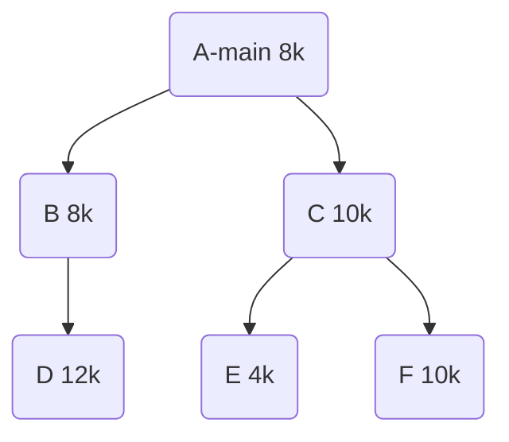

内存基础知识

##### 内存定义、作用

内存是存放数据的硬件。程序执行前<span style="color:red">需要先放到内存中才能被CPU处理</span>。

多道程序并发运行，如何区分各个程序放在内存中的位置？--给内存的存储单元编地址。

内存地址从0开始编号，<span style="color:red">每个地址对应一个存储单元</span>。

存储单元的大小，如果计算机“<span style="color:red">按字节编址</span>”，则<span style="color:red">每个存储单元的大小为1字节</span>，即1B = 8 个二进制位。

如果<span style="color:red">字长为16位</span>的计算机“<span style="color:red">按字编址</span>”，则<span style="color:red">每个存储单元的大小为1字</span>，每个字的大小为16个二进制位。【注】不同计算机字长不一样，32、64都可能。


##### 几个常用数量单位

```properties
2¹⁰ = 1K (千)
2²⁰ = 1M (兆/百万)
2³⁰ = 1G (10亿/千兆)
```

4GB = 4 * 2³⁰个字节 4 * 2³⁰个小房间

地址长度 = 多少个二进制位才能表示相应的存储单元。 4 * 2³⁰ = 2³²  => 地址长度为32位


##### 进程运行原理---指令

x = x + 1--> 编译 -->

指令1(<span style="color:red">00101100</span>,00000011,01001111) //数据传送指令

指令2(<span style="color:red">10010010</span>,00000011,00000001) //加法指令

指令3(<span style="color:red">00101100</span>,01001111,00000011) //数据传送指令

-->

地址为00000011的寄存器AX


##### 逻辑地址 vs 物理地址

<span style="color:red">相对地址</span>又称<span style="color:red">逻辑地址</span>

<span style="color:red">绝对地址</span>又称<span style="color:red">物理地址</span>


##### 从写程序到程序运行


目标模块（包含机器语言的逻辑地址）

装入模块形成完整的逻辑地址空间eg \*.exe、\*.dmg

在内存中形成最终的物理地址


##### 装入模块装入内存

装入的三种方式（用三种不同的方法完成<span style="color:red">从逻辑地址到物理地址的转换</span>）

绝对装入

静态重定位

动态重定位


<span style="color:red">绝对装入</span>：在编译时，如果知道程序将放到内存中的哪个位置，编译程序将产生绝对地址的目标代码。装入程序按照装入模块中的地址，将程序和数据装入内存。

绝对装入方式灵活性很低，只适用于<span style="color:red">单道程序环境</span>。


<span style="color:red">静态重定位</span>：又称<span style="color:red">可重定位装入</span>。编译、链接后的装入模块地址都是从0开始的，指令中使用的地址、数据存放的地址都是相对于起始地址而言的逻辑地址。可根据内存的当前情况，将装入模块装入到内存的合适位置。装入时对地址进行<span style="color:red">“重定位”</span> ，将逻辑地址转换为物理地址（地址变化是在装入时一次完成的）

静态重定位的特点是在一个作业装入内存时，<span style="color:red">必须分配其要求的全部内存空间</span> ，如果没有足够的内存，就不能装入改作业。


<span style="color:red">动态重定位</span> ：又称<span style="color:red">动态运行时装入</span> 。编译、链接后的装入模块地址都是从0开始的。装入程序把装入模块装入内存后，并不会立即把逻辑地址转换为物理地址，而是<span style="color:red">把地址转换推迟到程序真正要执行时才进行</span> 。因此装入内存后所有的地址依旧是逻辑地址。这种方式需要一个<span style="color:red">重定位寄存器</span>支持。

重定位寄存器存放，装入模块装入内存中的<span style="color:red">“起始地址”</span> 

采用动态重定位时<span style="color:red">允许程序在内存中发生移动</span> 。


##### 链接的三种方式

静态链接：在程序运行之前，先将各目标模块及他们所需的库函数链接成一个完整的可执行文件（装入模块）

装入时动态链接：将目标模块装入内存中时，边装入边链接。

运行时动态链接：在程序程序执行中需要该目标模块时，才对它进行链接。其优点是便于修改与更新，便于实现对目标模块的共享。


### 内存管理的概念

① 内存空间的分配与回收。

② 操作系统需要提供某种技术从逻辑上对内存空间进行扩充。

③ 操作系统需要提供地址转换功能，负责程序的<span style="color:red">逻辑地址</span> 与<span style="color:red">物理地址</span> 的转换。

④ 操作系统需要提供内存保护功能，保证各个进程在各自存储空间进程，互不干扰。


#####  内存保护

方法一：在CPU中<span style="color:red">设置一对上下限寄存器</span> ，存放进程的上下限地址。进程的某个指令要访问某个地址时，CPU检查是否越界。

方法二：采用<span style="color:red">重定位寄存器</span> （又称<span style="color:red">基址寄存器</span>） 和<span style="color:red">界地址寄存器</span> （又称<span style="color:red">限长寄存器</span> ），重定位寄存器存放进程的<span style="color:red">起始物理地址</span> ，界地址寄存器存放进程的<span style="color:red">最大逻辑地址</span> 。


### 覆盖与交换

##### 覆盖技术

程序运行所需内存大小大于物理内存总和。

- 思想：把程序<span style="color:red">分为多个段</span> （多个模块）。常用的段常驻内存，不常用的段需要时调入内存。

内存中会分为<span style="color:red">一个“固定区”</span>和<span style="color:red">若干个覆盖区</span>  

需要常驻内存的段放在<span style="color:red">"固定区"</span> 中，<span style="color:red">调入后不再调出</span> （除非运行结束）

不常用的段放在<span style="color:red">"覆盖区"</span> ，<span style="color:red">需要时调入内存，不需要时调出内存</span> 。




程序按照自身逻辑结构，那些不可能同时被访问的程序段共享一个覆盖区。

问题：<span style="color:red">必须由程序员声明覆盖结构</span> ，操作系统完成自动覆盖，<span style="color:red">对用户不透明</span>，增加了用户编程负担。


##### 交换技术

思想：内存空间紧张时，系统将内存中的某些进程暂时<span style="color:red">换出</span> 外存，把外存中某些已经具备运行条件的进程<span style="color:red">换入</span> 内存。（进程在内存与磁盘之间动态调度）

<span style="color:red">挂起</span>队列


<span style="color:red">中级调度（内存调度）</span> ，就是要决定哪个处于挂起状态的进程重新调入内存。

暂时换出外存等待的进程的状态为<span style="color:red">挂起状态 suspend</span> 

挂起态又可以进一步细分为<span style="color:red">就绪挂起，阻塞挂起</span> 两种状态


进程7状态模型


1，具有对换功能的操作系统中，通常把磁盘空间分为<span style="color:red">文件区</span> 和<span style="color:red">对换区</span> 。文件区主要用于存放文件，<span style="color:red">主要追求文件空间的利用率</span> ，因此文件区空间管理<span style="color:red">采用离散分配的方式</span> ；对换区空间只占磁盘空间的小部分，<span style="color:red">被换出的进程数据就存放在对换区</span> 。由于对换的速度直接影响到系统的速度，因此对换区空间的管理<span style="color:red">主要追求换入换出速度</span> ，因此对换区<span style="color:red">采用连续分配方式</span> 。总之，<span style="color:red">对换区IO速度比文件区快</span> 。

2，可优先换出阻塞进程，可换出优先级比较低的进程，为了防止优先级低的进程在被调入内存后很快被换出，需要考虑进程在内存中驻留时间。

<span style="color:red">【注意】PCB会常驻内存</span> ，不会被换出内存。


### 连续分配管理方式

<span style="color:red">连续分配</span>：指为用户进程分配的必须是一个<span style="color:red">连续的内存空间</span> 。

##### 单一连续分配

内存被分为<span style="color:red">系统区</span> 和<span style="color:red">用户区</span> 

缺点：内存中<span style="color:red">只能有一道用户程序</span> ，只能用于单用户、单任务的操作系统中，<span style="color:red">有内部碎片</span> ，存储器利用率低。

优点：实现简单，<span style="color:red">无外部碎片</span> ，可以采用覆盖技术扩充内存，不一定需要采取内存保护

<span style="color:red">内部碎片</span> ：分配给某进程的内存区域中，如果有些部分没有用上，就是内部碎片。


##### 固定分区分配

将整个<span style="color:red">用户区</span> 划分为<span style="color:red">若干个固定大小的分区</span> ，在<span style="color:red">每一个分区中只装入一道作业</span> 。

分区大小相等：缺乏灵活性，但很<span style="color:red">适合用于一台计算机控制多个相同对象的场合</span> 。

分区大小不等：灵活性增加。

优点：实现简单，<span style="color:red">无外部碎片</span> 

缺点：用户程序太大 >= Max(all sections)，此时不得不采用覆盖技术解决，但这会降低性能；<span style="color:red">会产生内部碎片</span> ，内存利用率低。

*分区说明表--数据结构*

实现各个分区的分配与回收，每一个表项对应一个分区，每个表项包含对应<span style="color:red">分区大小、起始地址、状态</span> 。

| 分区号 | 大小(MB) | 起始地址（M） |  状态  |
| :----: | :------: | :-----------: | :----: |
|   1    |    2     |       8       | 未分配 |
|   2    |    2     |      10       | 未分配 |
|   3    |    4     |      12       | 已分配 |


##### 动态分区分配

<span style="color:red">可变分区分配</span> ，这种分配方式<span style="color:red">不会预先划分内存区域</span> ，而是在进程装入内存时，<span style="color:red">根据进程大小动态建立分区</span> 。

动态分区分配<span style="color:red">没有内部碎片</span> ，但是有<span style="color:red">外部碎片</span> 。

<span style="color:red">内部碎片</span> ：分配给某个进程的内存区域中，如果有些部分没有用上。

<span style="color:red">外部碎片</span> ：是指内存中的某些空闲分区由于太小而难以利用。

可以通过<span style="color:red">紧凑Compaction技术</span>解决外部碎片问题。

🦮 1，系统用什么样的数据结构记录内存使用情况。

采用空闲分区表、空闲分区链

| 分区号 | 分区大小（MB） | 起始地址（M） | 状态 |
| ------ | -------------- | ------------- | ---- |
| 1      | 20             | 8             | 空闲 |
| 2      | 10             | 32            | 空闲 |

空闲分区链：每个分区起始部分和末尾部分设置指针，起始部分处可记录分区大小等信息。


🦮 2，当很多个空闲空间都能满足需求时，应该选择哪个分区进行分配。

<span style="color:red">动态分区算法</span> （分配算法对系统性能有很大影响）


🦮 3， 如何进行分区的分配和回收操作。


### 动态分区分配算法

##### 首次适应算法First Fit

<span style="color:red">算法思想</span>：每次都从低地址开始查找，找到第一个能满足大小的空闲分区。 

<span style="color:red">如何实现：空闲分区以地址递增的顺序排列</span> ，每次分配内存时，按顺序查找<span style="color:red">空闲分区表/空闲分区链</span> 。

缺点：首次适应算法每次都从链头开始查找，可能导致低地址部分出现很多小的空闲分区，而每次分配查找时，都要经过这些分区，也增加了查找开销。

<span style="color:red">算法开销小</span> 

##### 最佳适应算法Beat Fit

<span style="color:red">算法思想：</span> 尽可能留下大的空闲区，优先使用更小的空闲区。

<span style="color:red">如何实现：</span> 空闲分区<span style="color:red">按容量递增次序链接</span> 。每次分配内存时，按顺序查找<span style="color:red">空闲分区表/空闲分区链</span> 。

<span style="color:red">缺点：每次都选最小的分区进行分配，会留下越来越多越小的难以利用的内存块，这种方式会产生很多外部碎片</span> 

<span style="color:red">算法开销大</span> 

##### 最坏适应算法Worst Fit

又称<span style="color:red">最大适应算法</span> 

<span style="color:red">算法思想：</span> 为了解决最佳适应算法的问题，优先使用最大的连续空闲区。

<span style="color:red">如何实现：</span> 空闲分区<span style="color:red">按容量递减次序链接</span>，每次分配内存时，按顺序查找<span style="color:red">空闲分区表/空闲分区链</span> 。

<span style="color:red">缺点：每次都选最大的分区进行分配，虽然可以让分配后留下的空闲分区更大，更可用，但是这种方式会迅速导致较大的连续空闲区被用完。如果之后有大进程到达，就没有空闲内存分区可用了。</span> 

<span style="color:red">算法开销大</span> 

##### 邻近适应算法Next Fit

<span style="color:red">算法思想：</span> 解决首次适应算法的问题，每次查找从上次结束位置开始检索。

<span style="color:red">如何实现：</span> 空闲分区以地址递增的顺序排列，每次分配内存时<span style="color:red">从上次查找结束的位置开始</span> ，按顺序查找<span style="color:red">空闲分区表/空闲分区链</span> 。

优点：算法开销比较小，不需要对链表进行重新排列。

缺点：可能导致无论低地址，高地址空闲分区都有相同的概率被使用，也就导致了高地址部分的大分区更可能被使用，划分为小分区，最后导致无大分区可用（最大适应算法缺点）。

<span style="color:red">算法开销小</span> 


### 基本分页存储管理的基本概念

<span style="color:red">连续分配：</span> 为用户进程分配的必须是一个<span style="color:red">连续的内存空间</span> 。

<span style="color:red">非连续分配：</span> 离散分配方式，为用户进程分配的可以是一些<span style="color:red">分散的内存空间</span> 。

基本分页存储管理的基本思想--把内存分为一个个相等的小分区，再按照分区大小把进程拆分成一个个小部分。


将内存空间分为一个个<span style="color:red">大小相等的分区</span> 比如每个分区4KB，每个分区就是一个“<span style="color:red">页框</span> ”，或称"<span style="color:red">页帧</span> "、“<span style="color:red">内存块</span> ”、“<span style="color:red">物理块</span> ”。每个页框对应一个编号，即"<span style="color:red">页框号</span> "，或称“<span style="color:red">内存块号</span> ”、“<span style="color:red">页帧号</span> ”、“<span style="color:red">物理块号</span> ”。页框号<span style="color:red">从0开始</span> 。

将用户进程的地址空间也分为<span style="color:red">也页框大小相等</span> 的一个个区域，称为“<span style="color:red">页</span> ”或<span style="color:red">页面</span> 。每个页面也有一个编号，即"<span style="color:red">页号</span> "，页号也是<span style="color:red">从0开始</span> 。

【注】进程的最后一个页面可能没有页框那么大，因此，<span style="color:red">页框不能太大，否则容易产生过大的内部碎片</span> 。

操作系统<span style="color:red">以页框为单位为个个进程分配</span> 内存空间。进程的每个页分别放入一个页面框中。也就是说，进程的<span style="color:red">页面</span> 与内存的<span style="color:red">页框</span> 有<span style="color:red">一一对应</span> 关系。

##### 如何实现地址转换

逻辑地址->TO->物理地址

1，算出逻辑地址对应的<span style="color:red">页号</span> 。

2，要知道改页对应<span style="color:red">再内存中的起始地址</span> 。

3，算出逻辑地址<span style="color:red">在页面内的“偏移量”</span> 。

4，<span style="color:red">物理地址 = 页框始址 + 页内偏移量</span> 。

```properties
页号 			= (int) 逻辑地址 / 页面长度
页内偏移量 = (int) 逻辑地址 % 页面长度
```

页面<span style="color:red"> 在内存中的起始位置</span>：

// Todo


为了计算机计算方便，页号、页内偏移量、页面大小一般用<span style="color:red">2^n</span> 

Eg: 假设用32个二进制位表示逻辑地址，页面大小为2¹²B = 4096B  = 4KB

<span style="color:red">0号页</span> 的逻辑地址空间为 0 ～ 4095，用二进制表示应该是：

<span style="color:red">000000000000000000000</span>000000000000 ~ <span style="color:red">00000000000000000000</span>111111111111

<span style="color:red">1号页</span> 的逻辑地址空间为 4096 ～ 8191，用二进制表示应该是：

<span style="color:red">000000000000000000001</span>000000000000 ~ <span style="color:red">00000000000000000001</span>111111111111

<span style="color:red">2号页</span> 的逻辑地址空间为 8192 ～ 12287，用二进制表示应该是：

<span style="color:red">000000000000000000010</span>000000000000 ~ <span style="color:red">00000000000000000010</span>111111111111

 根据论证 = > 红色代表页号大小、白色代表偏移量大小

Eg: 逻辑地址为2(<span style="color:red">000000000000000000000</span>000000000010)，0号页在内存中的起始地址为X ，则逻辑地址2对应在物理地址应该是X + 000000000010。

Eg:逻辑地址为4097((<span style="color:red">000000000000000000001</span>000000000001)，1号页在内存中的起始地址为X ，则逻辑地址4097对应在物理地址应该是X + 000000000001。

结论：页面大小为2ᴷB，用二进制表示逻辑地址，则末尾K位即为<span style="color:red">页内偏移量</span> ，其余部分就是<span style="color:red">页号</span> 。


##### 逻辑地址结构

| 31....12 |   11....0    |
| :------: | :----------: |
|  页号 P  | 页内偏移量 W |


##### 页表

为了能知道进程中的每个页面在内存中存放的位置，操作系统要<span style="color:red">为每个进程建立一张页表</span> 。

1，一个进程对应一张页表

2，进程每一页对应一个也表项

3，每个页表项由页号和块号组成

4，页表记录<span style="color:red">进程页面和实际存放的内存之间的对应关系</span> 

M号块的起始地址就是M*内存块大小。

5，每个页表项的长度是相同的，<span style="color:red">页号是“隐含”的</span>

Eg:  物理内存大小4GB，页面大小4KB，则每个页表项大小至少应该为多少字节？

4GB = 2³²B 

4KB = 2¹²B

=> 2²⁰ 个内存块，因此内存块号的范围 0 ～ 2²⁰ -1 => 至少需要20 个二进制位才能表示 => 至少需要三个字节才能够。

各页表项会<span style="color:red">按顺序连续地</span> 存放在内存中。如果该页表在内存中存放的起始地址为X，则M号页对应页表项一定存放在内存地址为X + 3 * M。🦁(这里为啥要*3啊，不懂啊，难受啊，救救我吧)

只需要知道<span style="color:red">页表存放的起始地址</span> 和<span style="color:red">页表项长度</span> ，即可找到各个页号对应的页表项存放的位置。

| 页号 | 块号  |
| ---: | :---: |
|    0 | 3字节 |
|    1 | 3字节 |
|    2 | 3字节 |


### 基本地址变换机构

<span style="color:red">用于实现逻辑地址到物理地址转换的一组硬件机构</span> 

<span style="color:red">页表寄存器</span> （PTR），存放<span style="color:red">页表在内存中的起始地址F</span> 和<span style="color:red">页表长度M</span> ，程序未执行时，页表的始址和页表的长度<span style="color:red">放在进程控制块（PCB）中</span> ，当进程被调度时候，操作系统内核会把他们放到页表寄存器中。

设页面大小为L（<span style="color:red">L=2^n</span> ），逻辑地址A到物理地址E的变化过程如下：


页表中页号P对应的<span style="color:red">页表项地址 = 页表起始地址F + 页号P * 页表项长度</span> ，取出改页表项内容b，即为内存块号。<span style="color:red">页表项长度</span> ：指每个页表项占多大的内存空间，

<span style="color:red">页式管理中地址是一维的</span> ：只要确定了每个页面大小，逻辑地址结构就确定了（只用告诉逻辑地址信息）。


##### 页表项大小

<span style="color:red">每个页表项长度是相同的，页号是“隐含”的</span> 。


### 具有快表的地址变换机构

基本地址变换机构的改进版本

##### 局部性原理

```c
int i = 0;
int a[100];
while(i < 100){
  a[i] = i;
  i ++;
}
```

会频繁访问循环里面的指令内存块和数据内存块

<span style="color:red">时间局部性</span> 

程序存在大量循环，指令和数据很可能再次被访问

<span style="color:red">空间局部性</span> 

数据在内存中很多事连续存放的，数据内存区域的其他存储也很有可能被访问

由于局部性原理，<span style="color:red">可能多次查到的都是同一个页表项</span> 


##### 什么是快表TLB

<span style="color:red">联想寄存器(TLB)</span> ，是一种<span style="color:red">访问速度比内存快很多</span> 的高速缓冲存储器，用来存放当前访问的若干页表项，以加速地址变换的进程。内存中的页表项称为<span style="color:red">慢表</span> 。

 引入快表后，地址的变换过程

使用快表时，访问一个逻辑地址的平均耗时为：

（1 + 100)\*0.9 + (1+100+100)\*0.1 = 111us

快表慢表同时查找：

(1 + 100) \* 0.9 + (100 +100) \*0.1 = 110.9 us


### 两级页表

##### 单级页表存在的问题

Eg: 计算机系统按字节寻址，支持32位逻辑地址，采用分页存储管理。页面大小为4KB，页表项长度为4B。

4KB = 2¹² B，因此页内地址要12位标识，剩余20位表示页号

=> 系统中用户进程最多有2²⁰ 页 => 一个进程页表中，最多会有2²⁰  = 1M = 1,048,576个页表项  => 一个页表最大需要 2²⁰ \* 4B = 2²²B，需要2²²/2¹² = 2¹⁰=1024个页框存储改页表。

K号页对应的页表项存放位置 = 页表始地址 + K \* 4（要在<span style="color:red">所有页表项都连续存放</span> 的基础上才能使用这种方法）

2¹⁰=1024个连续页框来存放页表

根据局部性原理可知，进程在一段时间内只要访问某几个页面就可以正常了，因此没有必要让整个页表都常驻内存。

| 一级页号 | 内存块号 | 是否在内存中 |
| :------: | :------: | :----------: |
|    0     |    3     |      是      |
|    1     |    无    |      否      |

若想访问的页面不在内存中，则产生缺页终端（内中断），然后将目标页面从外存调入内存。


##### 两级页表的原理、地址结构

32位逻辑地址空间，页表项大小为4B，页面大小为4KB，则页内地址占12位。

=> 一个页框可以存1K = 1024个页表项

0#  1#  2# 1023# ～ 1024# ..........

|  31～22  |  21～12  |   11～0    |
| :------: | :------: | :--------: |
| 一级页号 | 二级页号 | 页内偏移量 |

<span style="color:red">页目录表、顶级页表、外层页表</span> 

Eg: 将逻辑地址（0000000000,0000000001,111111111111）转换为物理地址

① 按照地址结构将逻辑地址拆分为3部分。

②从PCB 中读出页目录表起始地址，在根据一级页号查找目标表，找到下一级页表在内存中存放的位置。


##### 需要注意的几个细节

1，采用多级页表机制，则<span style="color:red">各级页表的大小不能超过一个页面</span> 

Eg:某系统按字节编址，采用40位逻辑地址，页面大小为4KB，页表项大小为4B，假设采用纯页式存储，则要采用()级分页，页内偏移量为()位。

页内偏移量位数 = 4 \* 2¹⁰ =  2¹²  => 12 位

页号 = 40 -12 = 28 位

页面大小 =   2¹² B  、页表项大小 = 4B => 每个页面框可以存 2¹²/4 =  2¹⁰个页表项

=> 级数 = 3 个 分别为 8、10、 10

[注]编址、寻址的区别：

存储地址空间是指对存储器编码（编码地址）的范围。所谓编码就是对每一个物理存储单元（一个字节）分配一个号码，通常叫作“编址”。分配一个号码给一个存储单元的目的是为了便于找到它，完成数据的读写，这就是所谓的“寻址”（所以，有人也把地址空间称为寻址空间）

2，两级页表的<span style="color:red">访问次数</span> 分析（假设没有快表机构）

第一次访问内存：访问内存中的页目录表

第二次访问内存：访问内存中的二级页表

第三次访问内存：访问目标内存单元

<span style="color:red">N级页表访问一个逻辑地址需要N + 1次访问内存</span> 


### 基于分段存储管理方式

与“分页”最大的区别就是 --- 离散分配时所分配的地址空间的基本单位不同

##### 分段

进程地址空间，按照程序<span style="color:red">自身的逻辑</span>关系<span style="color:red">划分为若干个段</span> ，每个段都有一个段名（在低级语言中，程序员使用段名来编程），<span style="color:red">每段从0开始编址</span> 。

按内存分配规则：以段为单位进行分配，<span style="color:red">每个段在内存中占连续的空间</span> ，但<span style="color:red">各段之间可以不相邻</span> 。

优点：由于是按照逻辑功能模块划分，用户<span style="color:red">编程更方便，程序可读性更高</span>。

```sh
LOAD	 1, [D] <A>; //将分段D中A单元内的值读入寄存器1
STORE	 1, [X] <B>; //将寄存器1中的值存入分段X中的B单元
```

编译程序会将段名转换为段号

分段系统的逻辑地址结构由段号（段名）和段内地址（段内偏移量）所组成

| 31~16 |   15~0   |
| :---: | :------: |
| 段号  | 段内地址 |

<span style="color:red">段号的位数决定了每个进程最多可以分为几段</span> 

<span style="color:red">段内地址位数决定了每个段最大长度是多少</span> 


##### 段表

从物理内存中找到各个逻辑段的存放位置。操作系统需为每个进程建立一张段映射表。

| 段号 | 段长 | 基址 |
| ---- | ---- | ---- |
| 0    | 7K   | 80K  |
| 1    | 3K   | 120K |
| 2    | 6K   | 40K  |

1，每个段对应一个段表项，记录了该段在内存中的<span style="color:red">起始位置</span> （基址）和<span style="color:red">段的长度</span> 。

2，<span style="color:red">各个段表项的长度是相同的</span> ，🦁（难理解）<span style="color:red">段号可以是隐含的，不占存储空间</span> 。


##### 如何实现地址变换

<span style="color:red">00000000000000010</span>00000010000000000

(2，1024)

F+ 2* 段表项长大 = 段表地址

基址 + 段内偏移量 = 物理地址

段号<段表长度、段内偏移量<段长 否则 => 越界中断


##### 分段、分页管理对比

<span style="color:red">页</span>是<span style="color:red">信息物理单位</span> 。分页的主要目的是为了实现离散分配，提高内存利用率。分页只是系统管理上的需要，完全是系统行为，<span style="color:red">对用户是不可见的</span> 。

<span style="color:red">段</span> 是<span style="color:red">信息逻辑单位</span> 。分段的主要目的是为了更好的满足用户需求。一个段通常包含着一组属于逻辑模块的信息。<span style="color:red">分段对用户是可见的</span> ，用户编程时需要显示地给出段名。

页的大小时固定的，段的长度是不固定的。

<span style="color:red">分页</span> 的用户进程<span style="color:red">地址空间是一维的</span> 

<span style="color:red">分段</span> 的用户进程<span style="color:red">地址空间是二维的</span> 

<span style="color:red">分段</span> 比分页<span style="color:red">更容易实现信息的共享和保护</span> 

<span style="color:red">不能被修改</span> 的代码称为<span style="color:red">纯代码</span> 或<span style="color:red">可重入代码</span> （不属于临界资源），这样的代码可以被共享地访问。

访问一个逻辑地址需要几次访问内存？

1，<span style="color:red">分页（单级也表）</span> ：第一次访问内存 --- 查找内存中的页表，第二次访问内存 --- 访问目标内存单元。总共<span style="color:red">两次访问内存</span> 。

2，<span style="color:red">分段</span> ：第一次访问内存 --- 查找内存中的段表，第二次访问内存 --- 访问目标内存单元。总共<span style="color:red">两次访问内存</span> 。

分段系统也可以引入快表机构，减少内存访问次数。


### 段页式管理方式

##### 分页、分段管理方式优缺点

分页管理，内存空间利用率高，<span style="color:red">不会产生外部碎片</span> ，只会有少量页内碎片。不方便按照逻辑模块实现信息的共享和保护。

分段管理，很方便实现按照逻辑模块实现信息的共享和保护。如果段太长，为其分配很大的连续空间会很不方便。段式管理<span style="color:red">会产生外部碎片</span>（跟动态分配分配类似） 。


##### 分页、分段结合

将进程按逻辑模块分段，再将各段分页

| 31~16 | 15~12 |    11~0    |
| :---: | :---: | :--------: |
| 段号  | 页号  | 页内偏移量 |

段内地址再拆分 = 页号 + 页内偏移量

<span style="color:red">段号位数决定了给每个进程最多可以分几段</span> 

<span style="color:red">页号的位数决定了每段最大有多少页</span> 

<span style="color:red">页内偏移量决定了页面大小，内存块大小是多少</span> 

<span style="color:red">段页式管理的地址结构是二维的</span> 


##### 段表、页表

段表：每个段对应一个段表项，每个段表项由段号、<span style="color:red">页表长度、页表存放块号（页表起始地址）</span> 组成。每个<span style="color:red">段表项长度相等，段号是隐含的</span> 。

##### 如何实现地址转换

段表起始地址F、段表长度M

段号S、页号P、页内偏移量W

①	if(S >= M) => 越界中断

②    段表项存放的地址 = F + S * 段表项长度

③	if(P >= 页表长度) => 越界中断

④	根据页号找到页表 

⑤    物理地址 = 页表中内存块号 + 页内偏移量

<span style="color:red">第一次访问内存获取段表，第二次访问内存获取页表，第三次访问内存访问真实物理地址</span> 

<span style="color:red">也可以引入快表机构，用段号和页号作为查询快表的关键字，若命中则需一次访问内存即可</span> 


### 虚拟内存的基本概念

##### 传统存储管理方式特征、缺点


缺点：很多暂时用不到的数据也会长期占用内存，导致内存利用率不高。

<span style="color:red">一次性</span> ：<span style="color:red">作业必须一次性装入内存后才能执行</span> 。造成两个问题：①作业很大时，不能全部装入内存，导致<span style="color:red">大作业无法运行</span>； ②大量作业要求运行时，由于内存无法容纳所有作业，只有少量作业能执行，导致<span style="color:red">多道程序并发度下降</span> 。

<span style="color:red">驻留性</span> ：一旦作业被装入内存，就<span style="color:red">会一直驻留在内存中</span> ，直至作业运行结束。

可以用虚拟存储技术解决这些缺点，虚拟存储技术的提出主要是基于局部性原理。


##### 局部性原理

<span style="color:red">时间局部性</span> 

<span style="color:red">空间局部性</span> 

<span style="color:red">高速缓冲技术</span> 思想：将近期会频繁访问到的数据放到更高速到存储器中，暂时用不到的数据放到更低速的存储器中。

基于局部性原理，在程序装入时，可以将程序中<span style="color:red">很快用到的部分装入内存，暂时用不到的部分留在外存</span> 。在程序执行过程当中，当所访问的<span style="color:red">信息不在内存时</span> ，由<span style="color:red">操作系统负责将所需信息从外存调入内存</span> ，然后继续执行程序。若内存空间不够，由<span style="color:red">操作系统负责</span> 将内存中<span style="color:red">暂时用不到的信息换出内存</span> 。

在操作系统管理下，用户看起来有一个比实际内存大的内存，这就是<span style="color:red">虚拟内存</span> 。（操纵系统虚拟性的体现-逻辑上进行扩充）

<span style="color:red">易混淆知识点：</span> 

虚拟内存的<span style="color:red">最大容量</span> 是由计算机的地址结构（CPU寻址范围）确定的。

虚拟内存的<span style="color:red">实际容量</span> = min (内外存容量之和, CPU寻址范围)。

Eg: 某计算机地址结构为32位，按字节编址，内存大小为512MB，外存大小为2GB。

虚拟内存最大容量 = 2³²B = 4GB

虚拟内存实际容量 = 2GB + 512MB


##### 虚拟内存定义和特征

<span style="color:red">多次性</span>：无需在作业运行时一次性全部装入内存，允许被分成多次装入内存。

<span style="color:red">对换性</span>：作业运行时无需一直常驻内存，而是允许在作业运行过程中，将作业换入换出。

<span style="color:red">虚拟性</span>：逻辑上扩充了内存容量。


##### 如何实现虚拟内存技术

虚拟内存技术实现需要建立在<span style="color:red">离散分配</span>的内存管理方式上。


主要区别：在程序执行过程中，当所<span style="color:red">访问的信息不在内存中时，由操作系统负责将所需要的信息从外存调入内存</span> ，然后继续执行程序。--- 请求调页/段；若内存空间不够，由操作系统负责<span style="color:red">将内存中暂时用不到的信息换出到外存</span> 。--- 页面/段置换功能。


### 请求分页管理方式

##### 页表机制

请求分页存储管理也页表

| 页号 | 内存块号 | 状态位 | 访问字段 | 修改位 | 外存地址 |
| :--: | :------: | :----: | :------: | :----: | :------: |
|  1   |    b     |   1    |    10    |   0    |    y     |


状态位：页面是否调入内存

访问字段：可记录最近被访问几次，或记录上次被访问的时间，供置换算法选择换出页面时参考

修改位：页面调入内存后是否被修改过

外存地址：页面在外存中存放的位置


##### 缺页中断机构

（0，1024）

<span style="color:red">页面不存在内存</span> ，产生一个<span style="color:red">缺页中断</span> ，又操作系统的缺页<span style="color:red">中断处理程序处理中断</span> 。此时<span style="color:red">缺页的进程阻塞</span> ，放入阻塞队列，调页<span style="color:red">完成后将其唤醒</span> ，放回就绪队列。 

如果内存中有<span style="color:red">空闲块</span> ，则为进程<span style="color:red">分配一个内存块</span> ，将所缺页面装入该块，并修改页表中相应的页表项。

如果内存中<span style="color:red">没有空闲块</span> ，则<span style="color:red">由页面置换算法选择一个页面淘汰</span> ，若换出的页面在内存期间<span style="color:red">被修改过</span> ，则要将其<span style="color:red">写回外存</span> 。未修改过的页面不用写回外存。

<span style="color:red">缺页中断</span> 的发生是因为当前执行的指令想要访问的目标页面未调入内存而产生的，因此属于<span style="color:red">内中断</span> 。

中断分类


<span style="color:red">一条指令</span>在执行期间，<span style="color:red">可能产生多次缺页中断</span>  （一条指令访问多个数据）。


##### 地址变换机构

①	只有执行“写指令”才需要修改“修改位”。一般只需要修改快表中的数据，只要将快表中的项目删除时才需要写回内存中的慢表，可以减少内存访问次数。

②	和普通中断处理程序一样，缺页中断处理依然需要保留CPU现场。

③	换入、换出页面都需要启动慢速的I/O操作，可见，换入、换出太频繁，会有很大开销。

④	页面调入内存后，需要修改慢表，同时也需要把页表项复制到快表中。


### 页面置换算法

页面换入、换出需要磁盘I/O，会有较大的开销，因此好的页面置换算法应该<span style="color:red">追求更少的缺页率</span> 。

##### 最佳置换算法 -- OPT

OPT (optimal)，每次选择<span style="color:red">淘汰的页面</span> 将是<span style="color:red">以后永不使用</span> ，或者<span style="color:red">在最长时间内不再被访问的页面</span> ，这样可以保证最低的缺页率。

Eg: 系统为某进程分配了3个内存块，并考虑到有以下页面号引用串--依次访问

7、0、1、2、0、3、0、4、2、3、0、3、2、1、2、0、1、7、0、1

从0、1、7中淘汰一页。按最佳置换算法规则，<span style="color:red">最后一个出现的页号就是要淘汰的页面</span> 。

整个过程<span style="color:red">缺页中断</span>发生了<span style="color:red">9次</span> ，<span style="color:red">页面置换</span> 发生了<span style="color:red">6次</span> 。=> 缺页中断时未必发生了页面置换，若还有可以用的空闲内存块，就不用进行页面置换。

<span style="color:red">缺页率</span>  = 9 /20 = 45%

最佳置换算法可以保证最低的缺页率，但是实际上，只有进程执行过程中才知道接下来会访问到那个页面。操作系统无法提前预判页面访问序列，因此，<span style="color:red">最佳置换算法是无法实现的</span>。

 

##### 先进先出置换算法 -- FIFO

FIFO，每次选择<span style="color:red">淘汰的页面</span> 是 <span style="color:red">最早进入内存的页面</span> 。

把调入内存的页面根据调入的先后顺序排成一个队列，队列的最大长度取决于系统为进程分配了多少个内存块。

Eg: 假设系统为某进程分配了3个内存块，并考虑到下面页号引用串：

3、2、1、0、3、2、4、3、2、1、0、4

<span style="color:red">Belady 异常</span> ：当为进程分配到物理块数增大时，缺页次数不减反增的异常现象。

<span style="color:red">只有FIFO 页面置换算法回产生Belady 异常</span> ，另外FIFO算法实现虽然<span style="color:red">简单</span> ，但是该算法与实际运行时规律不适应，因为先进入的页面有可能最经常被访问，因此，<span style="color:red">算法性能差</span> 。


##### 最近最久未使用置换算法 -- LRU

LRU（Least Recently used）：每次<span style="color:red">淘汰的页面</span> 是 <span style="color:red">最近最久未使用的页面</span> 。

实现方法：赋予每个页面对应的页表项中，用<span style="color:red">访问字段记录该页面上次被访问以来所经历的时间t</span> 。当需要淘汰一个页面时，选择页面中Max(t)，即最近最久未使用的页面。

| 页号 | 内存块号 | 状态位 | 访问字段 | 修改位 | 外存地址 |
| :--: | :------: | :----: | :------: | :----: | :------: |
|      |          |        |          |        |          |

Eg: 假设系统为某进程分配了4个内存块，并考虑到下面页号引用串：

1、8、1、7、8、2、7、2、1、8、3、8、2、1、3、1、7、1、3、7

在手动做题，在<span style="color:red">逆向扫描过程中最后一个出现的页号就是要淘汰的页面</span> 。

该算法的实现需要专门的硬件支持，虽然算法<span style="color:red">性能好</span>（最接近最佳置换算法） ，但是<span style="color:red">实现困难，开销大</span> 。


##### 时钟置换算法 -- CLOCK

算法效果和开销的平衡

<span style="color:red">时钟置换算法</span> 是一种性能和开销较均衡的算法，CLOCK，或<span style="color:red">最近未用算法（NRU）</span> Not Recently Used。

<span style="color:red">简单CLOCK算法实现</span> ：

| 页号 | 内存块号 | 状态位 | 访问位 | 修改位 | 外存地址 |
| ---- | -------- | ------ | ------ | ------ | -------- |
|      |          |        |        |        |          |

访问位为1，表示最近访问过。

访问位为0，表示最近没访问过。

将内存中的页面通过链接指针<span style="color:red">链接成一个循环队列</span> 。

<span style="color:red">简单的CLOCK算法</span> 选择淘汰一个页面<span style="color:red">最多经过两轮扫描</span> 。

Eg: 假设系统为某进程分配了5个内存块，并考虑到下面页号引用串：

1、3、4、2、5、6、3、4、7


##### 改进型的时钟置换算法

简单的时钟置换算法仅考虑一个页面最近是否被访问过。事实上如果淘汰的页面没有被修改过，就不需要执行I/O操作写回外存。<span style="color:red">只有被淘汰的页面被修改过时，才需要写回外存</span>。

<span style="color:red">在其他条件都相同时，应优先淘汰没有被修改的页面</span>，避免I/O操作 -- 改进型时钟置换算法思想

  <span style="color:red">修改位 = 0</span>，表示页面没有被修改过；<span style="color:red">修改位 = 1</span>，表页面被修改过。

（<span style="color:red">访问位，修改位</span> ）

<span style="color:red">改进型CLOCK页面置换算法</span>选择一个淘汰页面<span style="color:red">最多会进行四轮扫描</span>  。

第一轮：第一优先级，最近没访问，且最近没修改。（0，0）

第二轮：第二优先级，最近没访问，但修改过的页面。（0，1）

第三轮：第三优先级，最近访问过，但是没有被修改的页面。（0，0）

第四轮：第四优先级，最近访问过，也修改过的页面。（0，1）


### 页面分配策略

##### 驻留集

<span style="color:red">驻留集</span> ：请求分页存储管理中给进程分配的物理块（内存块、页框）的集合。在采用虚拟存储技术系统中，驻留集大小一般小于进程总大小。

驻留集太小 -- 导致缺页频繁

驻留集太大 -- 多道程序并发度下降，资源利用率降低

##### 页面分配、置换策略

<span style="color:red">固定分配</span> ：操作系统位每个进程分配一组固定数目的物理块，在程序运行期间不在改变。即，<span style="color:red">驻留集大小不变</span> 。

<span style="color:red">可变分配</span> ：操作系统先为进程分配一定数目的物理块，在进程运行期间，可根据情况进行适当的增加、减少。即，<span style="color:red">驻留集大小可变</span> 。

<span style="color:red">局部置换</span> ：发生缺页时只能选自己进程的物理块置换。

<span style="color:red">全局置换</span> ：可以将操作系统保留的空闲物理块或别的进程持有的物理块，分配给缺页进程。

=> 3种分配置换方式

<span style="color:red">固定分配、局部置换</span> 

<span style="color:red">可变分配、局部置换</span> ：要根据发生<span style="color:red">缺页频率</span> 来动态增加或减少进程的物理块。

<span style="color:red">可变分配、全局置换</span> ：<span style="color:red">只要进程发生缺页，都将获得新的物理块</span> 。<span style="color:red">未锁定</span> 页面，系统会锁定一些页面，这些页面内容不能换出外存（如重要的内核数据）。


##### 调入页面的时机

预调页策略(运行前调入)：依据局部性原理 - 特指空间局部性原理，预测成功率只有50%左右，这种策略<span style="color:red">主要用于进程的首次调入</span> 。

请求调页策略(运行时调入)：进程<span style="color:red">在运行期间发现缺页时才将所缺页面调入内存</span> 。

##### 从何处调页

对换区：读写速度更快，采用连续分配方式。

文件区：读写速度更慢，采用离散分配方式。

<span style="color:red"> 对换区大小足够使用的方案</span>:

文件区 --复制--> 对换区 =>  调入内存 

​							对换区  <= 调出内存

<span style="color:red">对换区大小不足使用的方案</span>:

不会被修改的数据调入内存后，如果要调出是，不用重新写回磁盘。

被修改的页面，调出时要先写回对换区 ，如果还需要对换区的数据，需要从对换区换入内存。

<span style="color:red">UNIX方式</span> ：

第一次直接从文件区调入内存。


##### 进程抖动（颠簸）现象

刚刚换出的页面马上要调入内存，刚刚调入的页面马上要换出外存，这种频繁的页面调度为<span style="color:red">抖动（颠簸）</span> 。产生抖动的<span style="color:red">主要原因</span> 是进程频繁访问的页面数高于可用物理块数。（<span style="color:red">分配给进程的物理块不够</span> ）。


##### 工作集

研究为每个进程分配多少个物理块，Denning提出了“工作集”概念。

<span style="color:red">驻留集</span> ：请求分页存储管理中给进程分配的物理块（内存块、页框）的集合。

<span style="color:red">工作集</span>： 进程在某段时间间隔内，进程实际访问的页面集合。

操作系统会设置一个<span style="color:red">窗口尺寸</span> ，来算出工作集。

Eg: 窗口尺寸为4，求各时刻工作集

24、15、18、23、24、17、18、24、18、17、17、15

<span style="color:red">工作集大小</span> 可能小于窗口尺寸。

一般来说，<span style="color:red">驻留集大小不能小于工作集大小，否则进程运行过程中将频繁缺页</span>。
