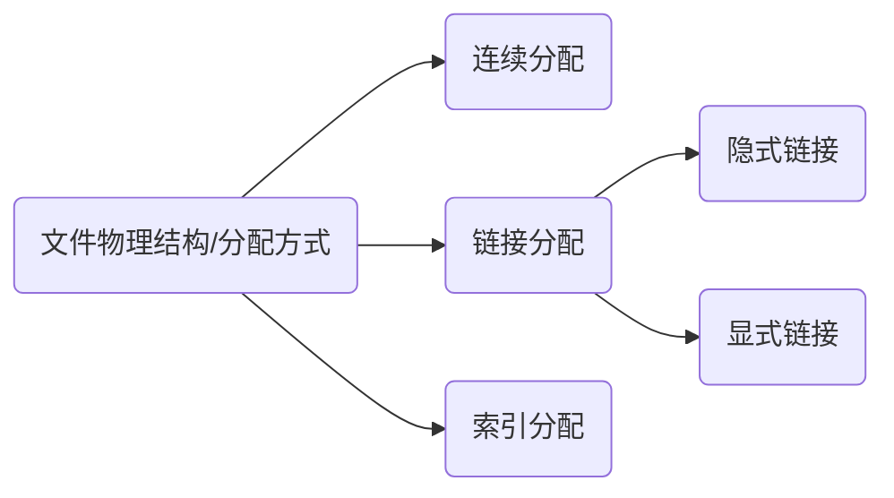
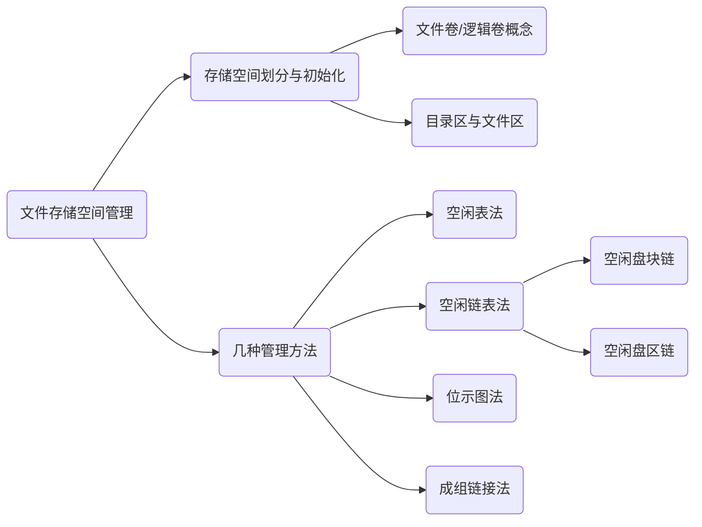
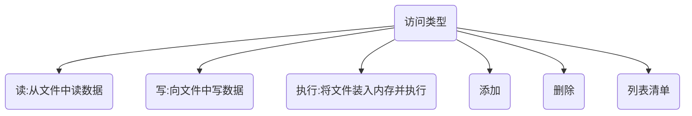

### 初识文件管理

文件	---	一组有意义信息/数据组合

计算机中存放了各种各样的文件，文件有哪些属性？

文件是一组有意义信息/数据组合，那<span style="color:red">文件内部</span>的数据应该怎么组织起来？

<span style="color:red">文件之间</span>又应该怎么组织起来？

操作系统为用户系统文件操作接口。文件怎么存？-- 从下往上

文件数据怎样存放在外存（磁盘）上？-- 从上往下

其他？

##### 文件属性

<span style="color:red">文件名</span>：由创建文件的用户决定文件名，主要为了方便用户找到文件，<span style="color:red">同一目录下不允许有重名文件</span> 。

<span style="color:red">标识符</span>：一个系统内，各个文件的标识符唯一，标识符只是用来区分各个文件的一种内部名称（一连串数字字母的组合）。

<span style="color:red">类型</span>：指明文件的类型（操作系统为特定的文件类型指定默认的打开程序）。

<span style="color:red">位置</span>：文件存放路径（用户使用）、在外存的地址（操作系统使用，对用户不可见）。

<span style="color:red">大小</span>：指明文件大小。

<span style="color:red">创建时间、上次修改时间、文件所有者信息</span> 。

<span style="color:red">保护信息</span> ：对文件进行保护的访问控制信息。


##### 组织文件内部数据

无结构文件（.txt文本文件），由一些二进制或字符流组成，又称“流式文件”。

有结构文件（如数据库表），由一组相似的记录组成，又称“记录式文件”。记录是一组相关数据项的集合，数据项是文件系统中最基本的数据单位。 文件逻辑结构 -- 在有结构文件中，各个记录该如何组织。


##### 组织文件之间数据

树状组织形式

根目录/目录/~/文件

所谓目录就是 = 文件夹

=> 文件通过目录合理有序的组织起来

<span style="color:red">目录</span>：也是一种有结构的特殊文件（由记录组成）


##### 由下而上

操作系统向上应该提供哪些功能。

<span style="color:red">创建文件</span> ，图形化交互进程在背后调用 <span style="color:red">create 系统调用</span> 。

<span style="color:red">读文件</span>功能，即<span style="color:red">read 系统调用</span> 。

<span style="color:red">写文件</span>功能，即<span style="color:red">write 系统调用</span> 。

<span style="color:red">删除文件</span> ，图形化交互进程在背后调用 <span style="color:red">delete 系统调用</span> 。

打开文件（open 系统调用）

关闭文件（close 系统调用）


##### 由上而下

操作系统对硬件进行管理（文件的物理结构）。

内存 -- 内存块

=> 外存 -- 块/磁盘块/物理块 （每个磁盘块保护整数幂个地址）

文件数据存放在连续的磁盘块中；文件数据存放在离散的磁盘块中 -- 此时如何记录磁盘块之间的先后顺序；操作系统如何管理磁盘块。


##### 其他

文件共享：使多个用户可以共享一个文件。

文件保护：如何保证不同用户对文件有不同操作权限。


### 文件的逻辑结构

文件“逻辑结构”：在用户看来，文件内部的数据是如何组织起来的。文件“物理结构”：在操作系统看来，文件数据如何存放在外存中的。

线性表是一种逻辑结构，一组有先后关系的元素序列。

线性表这种逻辑结构可以用不同的物理结构实现，顺序表/链表实现线性表。

=> 算法的具体实现跟逻辑结构和物理结构都相关。

##### 有结构文件

有结构文件（如数据库表），由一组相似的记录组成，又称“<span style="color:red">记录式文件</span> ”。记录是一组相关数据项的集合，数据项是文件系统中最基本的数据单位。 文件逻辑结构 -- 在有结构文件中，各个记录该如何组织。一般来说每条记录有一数据项可作为<span style="color:red">关键字</span>。根据各记录的长度（占用的存储空间）是否相等，又分为<span style="color:red">定长记录</span> 和 <span style="color:red">可变长记录</span> 两种。


##### 顺序文件

有结构文件逻辑结构--根据结构文件的各条记录在逻辑上如何组织。

文件中的记录一个接一个地顺序排列。

记录之间顺序与关键字无关 -- <span style="color:red">串结构</span> ，按存入的时间先后顺序决定。

记录之间顺序按关键字顺序排列 -- <span style="color:red">顺序结构</span> 。

【疑惑】：假设已经知道了文件的起始地址（也就是第一个记录存放的位置），能否快速找到第i个记录对应的地址（即能否实现随机存取），能否快速找到某个关键字对应记录存放的位置。

一般来讲考题中顺序文件<span style="color:red">指物理上顺序存储的顺序文件</span> ，顺序文件的<span style="color:red">缺点</span> 是<span style="color:red">增加/删除一个记录比较困难</span> （如果是串结构则相对简单）


##### 索引文件

对于可变长记录，要找到第i个记录，必须先顺序查找前i-1个记录，很多应用场景又必须使用变长记录。如何解决？

索引表项 -- 文件记录

<span style="color:red">索引表</span> 本身是 <span style="color:red">定长记录的顺序文件</span>  => 可以快速找到第i个记录的索引项。

可以将关键字作为索引号内容，若按关键字顺序排列，则可以支持按关键字折半查找。

增加/删除一个记录，索引表也需要进行修改。

索引文件有很快的检索速度，因此<span style="color:red">主要应用于对信息处理及时性要求比较高的场合</span> 。


### 文件目录

文件目录对用户来说有什么好处？

-- 文件之间组织结构清晰，易于查找。

-- 编程时也可以通过文件路径很快找到一个文件

```c
FILE *fp;
fp = fopen("/Users/hexiaogou/my_file.txt")
```


操作系统角度，文件目录怎么实现。

文件目录 == 等价于windows操作系统文件夹。

##### 文件控制块

根目录目录文件 -- 目录表

| 文件名    | 类型 | 存取权限 | ...  | 物流位置    |
| --------- | ---- | -------- | ---- | ----------- |
| qiangLong | 目录 | 只读     |      | 外存7号块   |
| bill.txt  | txt  | 读/写    |      | 外存324号块 |

目录本身就是一个有结构文件，由一条条记录组成，每条记录对应一个放在该目录下的一个文件。

=> 目录文件中的一条记录就是一个文件控制块(FCB)。

FCB有序集合就是文件目录，一个FCB就是一个文件目录项。

FCB实现了文件名和文件之间的映射。是用户（用户程序）可以实现“按名存取”。


需要对文件目录进行哪些操作。

<span style="color:red">搜索</span> ：

<span style="color:red">创建文件</span> ：

<span style="color:red">删除文件</span> ：

<span style="color:red">显示目录</span> ：

<span style="color:red">修改目录</span> ：


##### 目录结构

单级目录结构

整个系统只有一张目录表，单级目录实现了"按名存取"，但是<span style="color:red">不允许文件重名</span> 。不适用于多用户操作系统。


两级目录结构

早期多用户操作系统，采用两级目录结构。分为<span style="color:red">主目录结构</span> （MFD, Master File Dictionary），<span style="color:red">用户文件目录</span>，(UFD, User File Dictionary)。

 主文件目录记录用户名、和相应用户文件目录存放的位置。用户文件目录由该用户的FCB组成。

<span style="color:red">允许不同用户文件重名</span> 。文件名相同，但是对应的是不相同的两个文件数据。

也可以在目录上实现访问限制 -- 检查登陆时用户名是否匹配。

缺点：用户不可以把自己的文件进行分类。


多级目录结构
又称树形目录结构，每个目录下面有更低一级的目录，不同目录下面可以重名，路径名标识符是个字符串，各级目录之间用"/"隔开。<span style="color:red">从根目录出发</span> 的路径<span style="color:red">称为绝对路径</span> 。

```properties
/Users/hexiaogou/Desktop/Temp/文件.md
```

操作系统根据绝对路径一层一层地找到下一级目录。刚开始<span style="color:red">从外存读入根目录的目录表</span> ，然后逐级从外存读入目录表，多少级 = <span style="color:red">多少次磁盘I/O操作</span> 。逐级读入是低效的。

可以使用<span style="color:red">从当前目录出发</span>的<span style="color:red">"相对路径"</span>  。(磁盘I/O减少)

```properties
./Temp/文件.md
```

树形目录结构不是万能的，可以很方便对文件进行分类，层次结构清晰，也能更好地对文件进行管理和保护。但是树形结构<span style="color:red">不便于实现文件的共享</span> 。为此提出了<span style="color:red">无环图目录结构</span> 。


无环图目录结构

在树形目录的基础上，增加了一些指向同一节点的有向边，使整个目录成为一个<span style="color:red">有向无环图</span> ，可以更方便地实现多个用户之间的文件共享。

<span style="color:red">可以用不同的文件名指向同一个文件</span> ，甚至指向同一个目录（共享同一目录下的所有内容）。

处理删除时共享文件的指向问题

<span style="color:red">每个共享节点设置一个共享计数器</span> ，用于记录有多少个地方在共享该节点，用户在提出删除节点的请求时，只是删除该用户的FCB，并使<span style="color:red">共享计数器 -1</span> ，并不会直接删除共享节点。

<span style="color:red">只有共享计数器减为0时，才删除节点。</span> 

共享文件不同于复制文件，在<span style="color:red">共享文件中，不同用户指向同一文件，其中一个用户修改数据，所有用户可以看到文件数据的变化。</span> 


##### 索引节点

FCB数据结构的改进

在查找各级目录过程中，只需要用到文件名这个信息，只有文件名匹配，才要读出文件的其他信息，因此可以让目录表瘦身来提高效率。

| 文件名     | 索引节点指针 |
| ---------- | ------------ |
| qiang_long | x_x_x        |

索引节点：除了文件名之外的文件描述都放到这里。

存放在外存中的索引节点为<span style="color:red">磁盘索引节点</span> ，当索引节点放入内存后为<span style="color:red">内存索引节点</span> ，相比之下<span style="color:red">内存索引节点需要增加一些信息</span> ，比如文件是否被修改、有几个进程正在访问该文件等。

索引节点时对文件控制块的优化


### 文件物理结构-上

文件分配方式

操作系统需要对磁盘进行哪些管理：对非空闲磁盘块的管理（存放了文件数据的磁盘块）-- 文件物理结构/文件分配方式要探讨的问题，对空闲磁盘块的管理 -- 文件存储空间管理要探讨的问题。




文件物理结构或分配方式 == 文件数据应该怎样存放在外存中。


##### 文件块、磁盘块

类似于分页，磁盘中的存储单元也会被分为一个个“块/磁盘块/物理块”。很多操作系统中，<span style="color:red">磁盘块的大小与内存块、页面大小相同</span>。

磁盘块大小与内存块大小相同的好处 -- 内存与磁盘之间的数据交换（即读写操作、磁盘I/O），都是以块为单位进行的。即没错读一块，或每次写一块。大小相同时，进行数据交换很方便。

在内存管理中，进程的逻辑地址空间被分为一个个页面。同样的在外存管理当中，为了方便对文件数据进行管理，<span style="color:red">文件的逻辑地址空间也被分为一个个"文件块"</span> 。

于是文件的逻辑地址也可以表示为（<span style="color:red">逻辑块号、块内地址</span> ）的形式。

1M = 1K * 1K

<span style="color:red">操作系统为文件分配存储空间都是是以块为单位的。</span> 

 用户通过逻辑地址来操作自己的文件，操作系统负责实现从逻辑地址到物理地址的映射。


##### 连续分配

<span style="color:red">连续分配方式</span> 要求 <span style="color:red">每个文件在磁盘上占有一组连续的块</span> 。

（逻辑块号、块内地址）-> （物理块号、块内）只需要转换块号就行，块内地址保持不变。

| 文件名 | ...  | <span style="color:red">起始块号</span> | <span style="color:red">长度</span> |
| ------ | ---- | --------------------------------------- | ----------------------------------- |
| Aaa    |      | 4                                       | 3                                   |
| Bbb    |      | 10                                      | 4                                   |

用户给出想要访问的逻辑块号，操作系统找到该文件的目录项（FCB）...

<span style="color:red">物理块号 = 起始块号 + 逻辑块号</span> （当然，还需要检查用户提供的逻辑块号是否合法：逻辑块号 > = 长度 ==> 不合法）

可以直接计算出逻辑块号对应的物理块号，因此<span style="color:red">连续分配支持顺序访问和直接访问（即随机访问）</span> 。


<span style="color:red">连续分配方式</span>要求每个文件在磁盘占有一组连续的块。

磁盘这种硬件，想要读区磁盘中的磁盘块时，需要移动磁头，访问两个磁盘块相隔越远，移动磁头所需的时间越长。

结论：<span style="color:red">连续分配的文件在顺序读/写时速度最快</span>  。


缺点：

物理上采用<span style="color:red">连续分配的文件不方便拓展</span> 。

物理上采用<span style="color:red">连续分配，存储空间利用率低，会产生难以利用的磁盘碎片</span>--外部碎片，可以利用<span style="color:red">紧凑</span>技术来处理碎片，但是需要耗费很大的时间代价。


总结：

<span style="color:red">连续分配方式</span> 要求 <span style="color:red">每个文件在磁盘上占有一组连续的块</span> 。

<span style="color:red">优点</span>： 支持<span style="color:red">连续分配支持顺序访问和直接访问（即随机访问）</span> ；<span style="color:red">连续分配的文件在顺序读/写时速度最快</span>  。

<span style="color:red">缺点</span>：<span style="color:red">连续分配的文件不方便拓展</span> ；<span style="color:red">连续分配，存储空间利用率低，会产生难以利用的磁盘碎片</span>--外部碎片。


##### 链接分配

<span style="color:red">链接分配</span> 采取的是离散分配方式，可以为文件离散地分配磁盘块，用指针串起来。分为<span style="color:red">隐式链接</span>和<span style="color:red">显示链接</span>两种。

隐式链接 - 文件目录项

| 文件名 | ...  | <span style="color:red">起始块号</span> | <span style="color:red">结束块号</span> |
| ------ | ---- | --------------------------------------- | --------------------------------------- |
| Aaa    |      | 9                                       | 16                                      |

除了文件最后一个磁盘块之外，每个磁盘块中都会保存下一个磁盘块的指针，这些指针对用户是透明的。

逻辑块号到物理块号的转变 ？

用户给到要访问的逻辑块号i，操作系统找到该文件的目录项（FCB)...  从起始块号（0号块）依次读入对应的磁盘块。总共需要<span style="color:red">i+1</span>次磁盘I/O。

结论： 采用<span style="color:red">链式分配（隐式链接）</span>方式的文件，<span style="color:red">只支持顺序访问，不支持随机访问</span>  ，查找效率低。另外，指向下一个磁盘块的指针也需要耗费少量的存储空间。


是否方便拓展文件 ？

若要拓展文件，则可以随便找个空闲磁盘块，挂在文件磁盘块链尾，并修改文件FCB即可。

结论：采用<span style="color:red">链式分配（隐式链接）</span>方式的文件，<span style="color:red">很方便文件拓展</span> 。另外，所有空闲磁盘块都可以被利用，<span style="color:red">不会有碎片问题，外存利用率高</span> 。


显式链接 

用于连接各个磁盘块的指针显示地存放在一个表中，即文件分配表（File Allocation Table -- FAT）。

文件有多少个物理块，FAT就有多少个表项。

假设新创建的文件aaa依次存放的磁盘块为：2 - 5 - 0 - 1，bbb: 4 - 23 - 3

首先aaa - FCB为

| 文件名 | ...  | 起始块号 |
| ------ | ---- | -------- |
| Aaa    | ...  | 2        |
| Bbb    | ...  | 4        |

其次aaa - FAT为（-1表示结束块号）

| 物理块号 | 下一块                            |
| -------- | --------------------------------- |
| 0        | 1                                 |
| 1        | -1                                |
| 2        | 5                                 |
| 3        | -1                                |
| 4        | <span style="color:red">23</span> |
| 5        | 0                                 |
| ...      | ...                               |
| 23       | <span style="color:red">3</span>  |

【注意】:<span style="color:red">一个磁盘仅设置一张FAT。开机时，讲FAT读入内容并常驻内存。</span> FAT各个表项在物理上连续存储，且每个表项长度相同，因此物理块号字段可以时“隐含”的。


如何实现文件逻辑块号到物理块号的转变 ？

用户给到要访问的逻辑块号i，操作系统找到该文件的目录项（FCB)...

从目录项中找到起始块号，若i > 0，则查询内存中的文件分配表（FAT），往后找到i号逻辑块对应的物理块号。<span style="color:red">逻辑块号转换成物理块号的过程不需要读磁盘操作</span>。


采用：<span style="color:red">链式分配（显式链接）</span>方式的文件，支持顺序访问，<span style="color:red">也支持随机访问（想要访问i号逻辑块时，并不需要访问之前0～i-1号逻辑块）</span>，由于块号转换的过程不需要访问磁盘，因此相较于隐式链接来说，访问速度快了很多。

显然，<span style="color:red">链式分配（显式链接）方式不会产生外部碎片，也可以很方便地对文件进行拓展。</span>


缺点：文件分配表需要占用一定的存储空间。

考试题目中没有明确告诉式显式或隐式链接，<span style="color:red">默认</span>指<span style="color:red">隐式链接</span> 分配方式。

 

### 文件物理结构-下

##### 索引分配

<span style="color:red">索引分配</span> 允许文件离散地分配到各个磁盘块中，系统<span style="color:red">会为每个文件建立一张索引表</span> ，索引表<span style="color:red">记录了文件各个逻辑块对应的物理块</span> （索引表的功能类似于内存管理中的页表 -- 建立逻辑页到物理页之间的映射关系）。 索引表存放的磁盘块称为<span style="color:red">索引块</span> 。文件数据存放的磁盘块为<span style="color:red">数据块</span> 。


文件aaa数据一次存放的磁盘块：2 - 5 - 13 - 9

Aaa索引表 - 7 号磁盘块

| 逻辑块号 | 物理块号 |
| -------- | -------- |
| 0        | 2        |
| 1        | 5        |
| 2        | 13       |
| 3        | 9        |

目录中需要记录文件的索引块

| 文件名 | ...  | <span style="color:red">索引块</span> |
| ------ | ---- | ------------------------------------- |
| Aaa    | ...  | 7                                     |
| Bbb    | ...  | 23                                    |

 

【注】在显式链接的链接分配方式中，文件分配表FAT是一个磁盘对应一张表。而索引分配是一个文件对应一张。

可以用固定长度的存储空间来表示物理块号（磁盘总容量为1TB = 2⁴⁰B，磁盘块大小问1KB，则共有 2³⁰个磁盘块，则可以用4B表示磁盘块号）因此，索引表中的“逻辑块号”可以是隐含的。


如何实现从逻辑块号到物理块号的转变 ？

用户给到要访问的逻辑块号i，操作系统找到该文件的目录项（FCB)...  

FCB - 目录项索引块号 - 索引表读入内存 - 查找i号逻辑块在外存中存放的位置

可见，<span style="color:red">索引分配方式支持随机访问</span> 。<span style="color:red">文件拓展也很容易实现</span> 。（只需要给文件分配一个空闲块，并增加一个索引表项即可）。

缺点：索引块占有一定的空间。


若每个磁盘块大小为1KB，一个索引表项为4B，则一个磁盘块只能存放256个索引项。

1024/4 = 256

如果一个文件超过256个索引块，一个磁盘块装不下整张索引表，如何解决 ？

① 链接方案

<span style="color:red">链接方案</span> ：如果一个索引表太大，一个索引块装不下，可以讲多个索引块链接起来存放。

文件FCB表项中的索引块只记录第一个索引块的块号。

若一个文件的大小为256*256KB = 2^7 * 2^7 * 2^12= 2^26 = 64MB == 256*256块

对应256 * 256个索引项，也就需要256个索引块来存储，这些索引块用链接方案链接起来。

==> 读取最后一个磁盘块，需要先依次读取前255个索引块，效率很低


② 多层索引

<span style="color:red">多层索引</span> ：建立多层索引（<span style="color:red">原理类似于多级页表</span> ），使第一层索引块指向第二层索引块，还可以根据文件大小要求建立第三层、第四层索引块。

若每个磁盘块大小为1KB，一个索引表项为4B，则一个磁盘块只能存放256个索引项。

文件FCB表项中的索引块只记录顶级索引表对应索引块的块号。

若某文件采用<span style="color:red">两层索引</span> ，则该<span style="color:red">文件最大长度</span> 可以达到256*256KB = 64MB

采用多级索引结构，则<span style="color:red">各层索引表大小不能超过一个磁盘块</span> 。


如何实现从逻辑块号到物理块号的转变 ？

要访问1026号逻辑块

1026/256 = 4

1026%256 = 2

4...2 

<span style="color:red">访问目标数据块，需要3次磁盘I/O</span> (采用K层索引结构 + 一次数据=K+1)


若采用<span style="color:red">三层索引</span> ，则<span style="color:red">文件最大长度</span>为

256x256x256KB = 16GB

<span style="color:red">访问目标数据块，需要4次磁盘I/O</span>

要访问1026号逻辑块

第一层：1026/256x256 = 0

第二层：1026/256 = 4

第三层：1026%256 = 2

0...4...2

多层索引问题：

文件本身很小（<1KB）也需要读取固定的磁盘I/O次数。


③ 混合索引

<span style="color:red">混合索引</span> ：多种索引分配方式混合。如，一个文件的顶级索引表中，既包含<span style="color:red">直接地址索引</span> （直接指向数据块），又包含<span style="color:red">一级间接索引</span> （指向单层索引表）、还包含<span style="color:red">两级间接索引</span> （指向两层索引表）。

【注意】顶级索引表<span style="color:red">是否读入内存</span> 


优点：

对于小文件，只需要较少的读磁盘次数就可以访问目标数据块（一般计算机中小文件更多）


### 文件存储空间管理

对空间磁盘块管理



##### 存储空间划分与初始化

存储空间的划分：将物理磁盘划分为一个个文件卷（逻辑卷，逻辑盘）

文件卷C(C盘)，文件卷D(D盘)

文件卷包含目录区，文件区。目录区主要存放文件目录信息（FCB），用于磁盘存储空间管理。文件区用于存放文件数据。

存储空间初始化：将各个文件卷划分为目录区、文件区。

支持超大型文件的操作系统中，可支持由多个物理磁盘组成一个文件卷。


##### 空闲表法

存储空间管理方法

空闲盘块表 -- 与内存管理的动态分配的空闲表类似

| 第一个空闲盘块号 | 空闲盘块数 |
| ---------------- | ---------- |
| 0                | 2          |
| 5                | 1          |
| 10               | 5          |
| 18               | 3          |
| 23               | 1          |

适用于目录结构 -- 适用于连续分配方式。

如何分配磁盘块 ？

与内存管理的动态分配的空闲表类似，为一个文件<span style="color:red">分配连续的存储空间</span> 。同样可以采取<span style="color:red">首次适应、最佳适应、最坏适应等算法</span> 来决定要为文件分配那个空间。

Eg: 新创建的文件的请求需要3个块，采用首次适应算法。


如何回收磁盘块 ？

与内存管理的动态分配的空闲表类似，当回收某个存储区时需要有四种情况 -- ①回收区的前后都没有相邻空闲区；②回收区前后都有空闲区；③回收区前是空闲区；④回收区后是空闲区；

<span style="color:red">总之，合并时要注意表项的合并问题。</span> 

Eg: 回收区前后都有相邻空闲区,空闲表项减少1。


##### 空闲链表法

空闲盘块链、空闲盘区（连续的空闲盘块组成一个区）链

空闲盘块中存放了下一个空闲盘块的指针 - 以盘块为单位组成一条空闲链

空闲盘区中存放了下一个空闲盘区的指针 - 以盘区为单位组成一条空闲链

空闲盘区的<span style="color:red">第一个盘块</span> 会记录盘区的长度，下一个盘区的指针


空闲盘块链

操作系统保存这<span style="color:red">链头、链尾指针</span> 。

如何分配：若某个文件申请K个磁盘块，则从链头开始依次摘下K个盘块分配，并修改空闲链链头指针。

如何回收：回收的盘块依次挂到链尾，并修改空闲链链尾指针。

适用于离散分配的物理结构。为文件分配多个盘块时可能要重复多次操作。


空闲盘区链

操作系统保存这<span style="color:red">链头、链尾指针</span> 。

如何分配：若某个文件申请K个磁盘块，则可以采用首次适应、最佳适应等算法，从链头开始检索，按照要求找到一个大小符合要求的空闲盘区，分配给文件。若没有合适的连续空闲块，也可以将不同盘区的盘块同时分配给一个文件，注意分配后要修改相应的链指针，盘区大小等数据。

如何回收：若回收区与某个空闲盘区相邻，则需要将回收区合并到空闲盘中。若回收区没有和任何空闲盘区相邻，将回收区单独作为一个空闲盘区挂到链尾。

适用于离散分配，也适用于连续分配。为一个文件分配多个盘块时效率更高。


##### 位示图法

二进制位代表是否已分配

|      | 0    | 1    | 2    | 3    | 4    | 5    | 6    | 7    | 8    | 9    | 10   | 11   | 12   | 13   | 14   | 15   |
| ---- | ---- | ---- | ---- | ---- | ---- | ---- | ---- | ---- | ---- | ---- | ---- | ---- | ---- | ---- | ---- | ---- |
| 0    | 0    | 1    | 0    | 1    | 1    | 1    | 1    | 1    | 1    | 1    | 1    | 1    | 0    | 0    | 0    | 0    |
| 1    | 1    | 1    | 1    | 0    | 0    | 0    | 1    | 1    | 0    | 0    | 0    | 0    | 0    | 0    | 1    | 0    |
| 2    | 1    | ..   |      |      |      |      |      |      |      |      |      |      |      |      |      |      |

<span style="color:red">位示图</span> ：每个二进制为代表一个盘块。0 - 空闲盘块，1 - 盘块已分配。位示图一般用连续的“字”表示，字中每一位对应一个盘块。因此<span style="color:red">可以用（字号、位号）对应一个盘块号。</span>  == <span style="color:red">（行号、列号）</span>。

列0、1、2为字号，（字号 、位号）二元组来定位盘块。

<span style="color:red">重要重要重要</span> ：<span style="color:red">要能自己推算出盘块号与（字号、位号）相互转换的公式。</span> 

<span style="color:red">注意题目条件</span>  ：<span style="color:red">盘块号与（字号、位号）</span>是从0还是从1开始。

从0开始：

（字号、位号） = （i，j）的二进制位对应的盘块号b = in + j

​	字号 = b/n；位号 = b%n

从1开始：

 i = 1时（字号、位号） = （i，j）

 i > 1时（字号、位号） = （i，j）的二进制位对应的盘块号b = in + j

 i = 1时    字号 = 1；位号 = n

 i > 1时	字号 = b/n；位号 = b%n

如何分配 ：若需要K个块，①顺序扫描位示图，找到K个相邻或不相邻的'0'；②根据字号、位号算出对应的盘块号，将相应的盘块分配给文件；③将相应位设置位“1”。

如何回收：①根据回收的盘块号计算出对应的字号、位号；②将相应的位设置位“0”


采用位示图时，连续分配和离散分配都适用。


##### 成组链接法

空闲表法、空闲链表法不适用与大型的文件系统，因为空闲表法/空闲链表法可能过大。UNIX系统中采用了<span style="color:red">成组链接法</span> 对磁盘空闲块进行分组管理。

<span style="color:red">文件卷目录区中</span>专门用一个磁盘块作为<span style="color:red">超级块</span> ，当系统启动是需要将<span style="color:red">超级块入内存</span> ，并且要保证超级块内存与外存数据一致。

超级块中记录了下一个空闲盘块数以及这些空闲盘块的盘块号，

第一空闲盘块还需要记录下一组空闲盘块的信息

倒数第二层第一个空闲盘块为-1 -- 若没有下一组空闲块设定的特殊值。

【注】每个分组的盘块号并不一定连续。

最后一个分组的盘块数是少一个的


Eg：需要1个空闲块

如何分配：①检查第一个分组的块数是否足够。1 < 100，因此是足够的；②分配第一个分组中的一个空闲块，并修改相应的数据。

Eg：需要100个空闲块

如何分配：①检查第一个分组的块数是否足够。1 = 100，因此是足够的；②分配第一个分组中的100个空闲块，但是<span style="color:red">300号块内存放了再下一组的信息，因此300号块的数据需要复制到超级块中</span> 

如何回收：比较难理解

超级块充当链头的作用，保持指向下一个分组的信息。


### 文件的基本操作

##### 创建文件

<span style="color:red">创建文件</span> （点击新建之后，图形化交互界面在背后调用了<span style="color:red">create 系统调用</span> ）。

create 系统调用需要提供的几个参数：

1，所需外存空间大小（如一个盘块，即1KB）

2，文件存放路径（/User/hexiaogou）

3，文件名（这个地方会有一个默认值，mac - undefined，windows - 新建文档.txt）

操作系统在处理create系统调用时，主要做了两件事情

<span style="color:red">1，在外存中找到文件所需的空间。</span> 

<span style="color:red">2，创建该文件对应的目录项。</span> 


##### 删除文件

<span style="color:red">删除文件</span> （点击新建之后，图形化交互界面在背后调用了<span style="color:red">delete 系统调用</span> ）。

delete系统调用需要提供的几个参数：

1，文件存放路径（/User/hexiaogou）

2，文件名（demo.txt）

操作系统在处理delete系统调用时，主要做了几件事情

<span style="color:red">1，找到文件名对应目录项。</span> （根据文件存放路径）

<span style="color:red">2，回收文件占用的磁盘块。</span> （根据该目录项的文件在外存中存放的位置、文件大小等信息）

<span style="color:red">3，从目录表中删除文件对应的目录项。</span> 


##### 打开文件

在很多操作系统中，在对文件进行操作之前，要求用户先使用open系统调用“打开文件”，需要提供的几个参数：

1，文件存放路径（/User/hexiaogou）

2，文件名（demo.txt）

3，要对文件的操作类型（r - 只读，w - 只写，rw - 读写）

操作系统在处理open系统调用时，主要做了几件事情

<span style="color:red">1，找到文件名对应目录项。</span> （根据文件存放路径）

<span style="color:red">2，将目录项复制到内存中，“打开文件表”中</span> 。并将对应表目的编号返回给用户。之后<span style="color:red">用户使用打开文件的编号来指明要操作的文件</span>。-- 用户再操作此文件时，<span style="color:red">不需要每次都重新查目录了</span> (可以加速文件访问速度)。

打开文件表：系统打开的文件表（整个系统只有一张）、用户进程的“打开文件表”。

系统打开的文件表（整个系统只有一张）--系统表索引号-- 用户进程的“打开文件表”。


系统打开的文件表：

系统打开的文件表中的<span style="color:red">打开计数器</span> 表示这个文件此时已经被几个进程打开了。

可以方便实现某些文件管理功能，比如不能删除已经打开了的文件。


用户进程的“打开文件表“：

有读写指针（改用户进程对文件读写操作进行到的位置）、访问权限字段。

 

##### 关闭文件

操作系统在处理close系统调用时，主要做了几件事情

1，将进程的打开文件表相应表项删除

2，回收分配给该文件的内存空间资源等

3，系统打开的文件表中的<span style="color:red">打开计数器</span> count -1，若count = 0 ，则删除对应表项


##### 读文件

将文件读入内存，操作系统在处理read系统调用

对应进程的“打开文件表”，需要指明是那个文件（在支持“打开文件”操作的系统中，只需提供文件在打开文件表中的索引号<span style="color:red">文件描述符</span> 即可），还需要指明要读入多少数据（如读入1KB），指明读入的数据要放在内存中的什么位置。

操作系统会从读指针指向的外存中，将用户指定大小的数据读入用户指定的内存区域中。


##### 写文件

将文件数据从内存写回外存，操作系统在处理write系统调用

需要指明是那个文件（在支持“打开文件”操作的系统中，只需提供文件在打开文件表中的索引号即可），还需要指明要写出多少数据（如读入1KB），指明写回外存的数据放在内存中的什么位置。

操作系统会从用户指定的内存区域中，将指定大小的数据写回写指针指向的外存。


### 文件共享

操作系统提供文件共享功能，可以让多个用户共享地使用同一个文件。	

文件共享方式有两种：基于索引节点的共享方式（硬链接）、基于符号链的共享方式（软链接）

<span style="color:red">注意</span>：多个用户共享同一个文件，意味着系统中只有“一份”文件数据。并且某个用户修改了文件数据，其他用户也可以看到文件数据的变化。

 复制：多用户复制了同一份文件，那么系统中会有好几份文件数据，某个用户修改了文件数据，其他用户文件数据没有影响。

##### 索引节点共享方式

不同用户的目录项指向统一索引节点的索引指针。

索引节点 == 文件目录的瘦身策略。由于检索文件时只需要用到文件名，因此可以除了文件名之外的其他信息放到索引节点中。这样目录就只需要包含文件名，索引节点指针。

索引节点之中设置了一个链接计数器变量count，用于表示链接到本索引节点上的用户目录项数。

不同用户目录项文件名可以不同，指向的索引节点指针却可以相同。

某个用户决定“删除”该文件，则只要把对应用户文件目录项删除，且索引节点count - 1。

若count > 0 ，说明还有别的用户要使用该文件，暂时不能把文件数据删除，否则会导致指针悬空。当count = 0 时系统负责删除文件。


##### 符号链共享方式

索引节点指向的文件中存放新创建的Link型文件，记录了硬链接文件存放的路径，类似于windows系统中的快捷方式。

软链接指向的文件删除，Link型文件依然是存在的，只是指向的的文件被删除了（依照Link型文件中的路径查找共享文件失败）。

由于用软链接方式访问共享文件要查询多级目录，会有多次磁盘I/O，因此用软链接区访问文件的速度比硬链接慢。

### 文件保护

保护文件数据安全

##### 口令保护

为文件设置一个口令（abc123），用户请求该文件时必须提供口令。

口令一般存放在文件对应的FCB或索引节点中，用户访问文件前需要先输入口令，操作系统会将用户提供的口令与FCB中存储的口令进行对比。争取允许该用户访问文件。

优点：保存口令的空间开销不多，验证口令时间开销也小。

缺点：正确的口令存放在系统内部，不安全。

##### 加密保护

使用某个密码对文件进行加密，在访问文件时需要提供正确的密码，才能对文件进行正确的解密。

系统中保存的时对文件系统加密后的文件数据。

Eg -- 异或加密算法，加密和解密的密码一致

优点：保密性强，不需要在系统中存储密码

缺点：编码/译码，或者加密/解密需要花费一定时间。


##### 访问控制

在每个文件FCB(索引节点)中增加一个访问控制列表（Access - Control List ACL），该表中记录了各个用户可以对该文件执行哪些操作。

每个文件有张自己的访问控制表。

访问控制类型



添加：将新信息添加到文件结尾部分

删除：删除文件，释放空间

列表清单：列出文件名和文件属性

| 用户   | 读   | 写   | 执行 | 添加 | 删除 | 列表清单 |
| ------ | ---- | ---- | ---- | ---- | ---- | -------- |
| Son    | 0    | 0    | 0    | 0    | 0    | 0        |
| Father | 1    | 1    | 1    | 1    | 1    | 1        |
| Mother | 1    | 0    | 1    | 0    | 0    | 1        |

有的计算机可能会有很多个用户，因此访问控制列表可能会很大，可以用精简的访问控制列表来解决（以组为单位，标记各组用户对文件可以执行哪些操作 -- 管理员、文件主、文件主伙伴、其他）

用户想要访问某个文件，系统先检查该用户所属分组是否有相应的访问权限。

操作系统需要管理分组信息 -- 精简的访问控制表

| 用户       | 完全控制 | 执行 | 修改 | 读取 | 写入 |
| ---------- | -------- | ---- | ---- | ---- | ---- |
| 系统管理员 | 1        | 1    | 1    | 1    | 1    |
| 文件主     | 0        | 1    | 1    | 1    | 1    |
| 文件主伙伴 | 0        | 1    | 0    | 1    | 0    |
| 其他       | 0        | 0    | 0    | 0    | 0    |

若想要某个用户能够读出文件，需要把用户划分到文件主/文件主伙伴组即可。

如果对某个目录进行了访问权限的控制，那也要对目录下所有文件进行相同的访问权限控制。


### 文件系统的层次结构

用户/应用程序 -- 用户接口 -- 文件目录系统 -- 存取控制模块 -- 逻辑文件系统与文件信息缓冲区 -- 物理文件系统 --辅助分配模块/设备管理模块 - 设备

用户接口：处理用户发出的系统调用请求（Read、Write、Open、Close等系统调用）。

文件目录系统：根据用户提供的文件路径找到相应的FCB或索引节点。所有和目录、目录项相关的管理工作都在该层完成，如管理活跃的文件目录表，管理打开文件表等。

存取控制模块：问了保证文件数据安全，还需要验证用户是否有访问权限，这一层主要完成了文件保护相关功能。

逻辑文件系统与文件信息缓冲区 ：用户指明要访问文件记录号，这一层需要将记录号转换为对应的逻辑地址。若采用索引文件这种逻辑结构，索引文件中的各个记录建立一个索引表，要获取文件内容，需要先将索引表调入文件信息缓冲区中。

物理文件系统 ：逻辑地址转换为实际物理地址。

辅助分配模块：负责文件存储空间的管理，即负责分配与回收存储空间。

设备管理模块：直接与硬件交互，负责和硬件直接相关的一些管理工作，如分配设备，分配设备缓冲区，磁盘调度，启动设备，释放设备等。


##### 举例回顾

假设某个用户请求删除文件/Users/hexiaogou/student_info.xlsx的最后100条信息。

1，用户需要操作系统提供的接口发出上述请求 -- <span style="color:red">用户接口</span> 

2，由于用户提供的时文件系统的存放路径，因此需要操作系统一层一层的查找目录，找到对应的文件目录项 -- <span style="color:red">文件目录系统</span> 

3，不同用户对文件有不同的权限，因此为了保证安全，需要检查用户是否有访问权限 -- <span style="color:red">存取控制模块(存取控制验证层)</span>

4，验证了用户访问权限后，需要把用户提供的记录号转变为对应的逻辑地址 -- <span style="color:red">逻辑文件系统与文件信息缓冲区 </span> 

5，知道了目标记录对应的逻辑地址后，还需要转换成实际物理地址 -- <span style="color:red">物理文件系统</span> 

6，要删除这条记录，必定要对磁盘设备发出请请求 -- <span style="color:red">设备管理程序模块</span> 

 7，删除记录后，会有一些盘块空闲，因此要将这些空闲盘块回收 -- <span style="color:red">辅助分配模块</span> 
