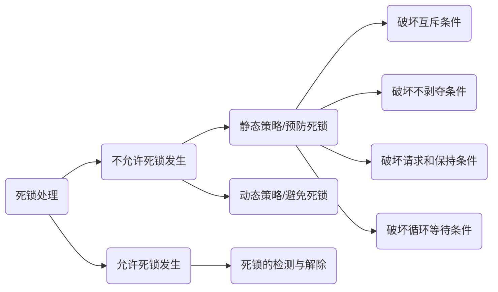

### 死锁的概念

##### 什么是死锁

哲学家进餐问题，如果5位哲学家进程并发执行，都拿起了左边的筷子

```c
semaphore chopsticks[5] = {1,1,1,1,1};
Pi(){
  while(1){
    P(chopsticks[i]); 			//take left
    P(chopsticks[(i+1)%5]);	//take right
    eat rice;
    V(chopsticks[i]);				//down left
    V(chopsticks[(i+1)%5]);	//down right
    think;
  }
}
```

每位哲学家都在等待自己右手边的人放下筷子，这些哲学家进程都因为等待筷子资源而被阻塞，即发生死锁。

每个进程都占有一个系统资源，同时又等待另一个进程释放资源，发生“死锁”。

并发环境下，各进程因为竞争资源而造成一种<span style="color:red">互相等待对方手里的资源，导致各进程都阻塞，都无法向前推进的现象</span> ，就是死锁，发生死锁后若无外力干涉，这些进程将永远无法向前推进。

##### 进程死锁、饥饿、死循环区别

死锁：各进程互相等待对方手里的资源，导致各进程都阻塞，无法向前推进的现象。

饥饿：由于长期得不到想要的资源，某进程无法向前推进的现象。比如，短进程优先（SPF)算法中，若有源源不断的短进程到来，则长进程一直得不到处理机，从而发生长进程“饥饿”现象。

死循环：某进程执行过程中一直跳不出某个循环的现象，有时是因为程序逻辑bug导致，有时是程序员故意设计的。

共同点：三者共同的是进程发生了异常的某种状况而无法继续往下推进的的现象

区别：

①死锁一定是“循环等待对方手里的资源”导致的，如果有死锁现象，那<span style="color:red">至少有两个或两个以上的进程同时发生死锁</span> 。另外，发生死锁的进程一定处于阻塞状态。

② <span style="color:red">可能只有一个进程发生饥饿</span> ，发生饥饿的进程可能是阻塞态（如果长期得不到需要的I/O设备），也可能处于就绪态（长期得不到处理机）

③可能只有一个进程发生死循环，死循环的进程可以上处理机运行（可以是运行态），只不过无法像期待的那样顺利进行推进。死锁和饥饿问题是由于操作系统分配资源的策略不合理导致的，而死循环是由代码逻辑的导致的。

<span style="color:red">死循环和饥饿是管理者（操作系统）问题，死循环是被管理者问题</span> 。

##### 产生必要条件

产生死锁必须同时满足以下四个条件，只要其中一个条件不成立，死锁就不会发生

<span style="color:red">互斥条件</span> ：只有对必须互斥使用的资源争夺才会导致死锁（如哲学家的筷子，打印机设备），像内存、扬声器这样可以同时让多个进程使用的资源是不会导致死锁的（因为进程不用阻塞等待这种资源）

<span style="color:red">不剥夺条件</span> ：进程所获得的资源在未使用完之前，<span style="color:red">不能由其他进程强行夺走</span> ，只能主动释放。

<span style="color:red">请求和保持条件</span> ：进程<span style="color:red">已经保持了至少一个资源</span> ，但又提出了新的资源<span style="color:red">请求</span> ，而该资源又被其他进程占有，此时请求进程被阻塞，但又对自己已有的资源<span style="color:red">保持</span> 不放。

<span style="color:red">循环等待条件</span> ：存在一种进程<span style="color:red">资源的循环等待链</span> ，链中的每个进程已获得资源同时被下一个进程所请求。

<span style="color:red">[注]：发生死锁一定要有循环等待，但是循环等待时未必死锁（循环等待是死锁的必要不充分条件）</span> 

即使发生了循环等待资源的现象，如果同类资源数目大于1，也未必发生死锁现象。但是如果系统中每类资源的数目都是1，那么循环等待就是死锁发生的充分必要条件了。

##### 发生死锁的情况

什么时候会发生死锁

1，对系统资源的竞争。各进程对不可剥夺的资源（打印机）的竞争可能引起死锁，对剥夺的资源CPU的竞争不会引起死锁。

2，进程推进顺序非法，请求和释放资源的顺序不当，也同样会导致死锁。例如，并发执行的进程P1、P2分别申请占有了资源R1、R2，之后进程P1又紧接着申请资源R2，而进程P2又申请资源R1，两者会因为申请的资源被双方占有而阻塞，从而发生死锁。

3，信号量的使用不当也会导致死锁。如生产者、消费者问题中，如果实现互斥的P操作在实现同步的P操作之前，就可能导致死锁（可以把互斥信号量、同步信号量看作是一种抽象的系统资源）

总之，对不可剥夺资源的不合理分配，可能导致死锁。


##### 处理策略

1，预防死锁：破坏死锁产生的四个必要条件中的一个或几个。

2，避免死锁：用某种方法防止系统进入不安全状态，从而避免死锁（银行家算法）

3，死锁的检测和解除：允许死锁的发生，不过操作系统会负责检测出死锁的发生，然后才去某种措施解除死锁。

死锁的处理




### 预防死锁

主要思想：破坏死锁产生的四个必要条件中的一个或几个

##### 破坏互斥条件

<span style="color:red">互斥条件</span> ：只有对必须互斥使用的资源争夺才会导致死锁

互斥使用的资源改为可以同时使用的资源

如果把只能互斥使用的资源改造为允许共享使用，则系统不会进入死锁状态，比如SPOOLing技术。操作系统可以采用SPOOLing技术把独占设备在逻辑上改造成共享设备。

该策略的<span style="color:red">缺点</span> ：并不是所有的资源都可以改造成可共享使用的资源，并且为了系统安全，很多地方还必须保护这种互斥性。因此，<span style="color:red">很多时候都无法破坏互斥条件</span>。适用范围并不广。

##### 破坏不剥夺条件

<span style="color:red">不剥夺条件</span> ：进程所获得的资源在未使用完之前，<span style="color:red">不能由其他进程强行夺走</span> ，只能主动释放。

方案一：

当某个进程请求新的资源不被满足时，它必须理解释放保持的所有资源，待以后需要时再重新申请。也就是说，即使某些资源尚未使用完，也需要主动释放，从而破坏了不可剥夺条件。

方案二：

当某个进程需要的资源被其他进程所占有时，可以由操作系统协助，将想要的资源强行剥夺。这种方式一般需要考虑各进程的优先级（比如，剥夺调度方式，将处理机资源强行剥夺给优先级更高的进程使用）

改策略的<span style="color:red">缺点</span>：1，实现起来比较复杂；2，释放已获得的资源可能造成前一阶段的工作实效，因此这种方法一般只适用于易保存和易恢复状态的资源，如CPU；3，反复地申请和释放资源会增加系统开销，降低系统吞吐量；4，若采用方案一，意味着只要暂时得不到某个资源，之前获得的那些资源就都需要放弃，以后再重新申请，如果一直发生这样的情况，就会导致进程饥饿。

##### 破坏请求和保持条件

<span style="color:red">请求和保持条件</span> ：进程<span style="color:red">已经保持了至少一个资源</span> ，但又有新的资源请求，而该资源又被其他进程占有，此时请求进程被阻塞，但又对自己已有的资源保持不放。

可以采用<span style="color:red">静态分配方法</span> ，即进程在运行前一次申请完它所需要的全部资源，在它资源未满足前，不让它投入运行。一旦投入运行后，这些资源就一直归它所有，该进程就不会再请求别的任何资源了。

该策略实现起来比较简单，但是也有明显的<span style="color:red">缺点</span>。

有的资源可能只需要用很短的时间，因此如果进程的整个运行期间一直保持着所有资源，就会造成严重的资源浪费，<span style="color:red">资源利用率极低</span> 。另外，该策略也有<span style="color:red">可能导致某些进程饥饿</span> 

##### 破坏循环等待条件

<span style="color:red">循环等待条件</span> : 存在一种进程<span style="color:red">资源的循环等待链</span> ，链中的每一个进程已获得的资源同时被下一个资源所请求。

可以采用<span style="color:red">顺序资源分配法</span> 。首先给系统中的资源编号，规定每个进程<span style="color:red">必须按编号递增的顺序请求资源</span> ，同类资源（即编号相同的资源）一次申请完。

原理分析：一个进程只有已占有小编号资源时，才有资格申请更大编号的资源。按此规则，已持有大编号资源的进程不可能逆向地回来申请小编号资源，从而就不会产生循环等待的现象。

在任何一个时刻，总有一个进程拥有的资源编号是最大的，那这个进程申请之后的资源必然是畅通无阻的，因此不可能出现所有进程都阻塞的死锁现象。

该策略<span style="color:red">缺点</span> 

1，不方便增加新的设备，因为可能需要充分分配所有的编号。

2，进程实际使用资源的顺序可能和编号递增的顺序不一致，会导致资源的浪费。

3，必须按照次序申请资源，用户编程麻烦

### 避免死锁

（不允许死锁发生）

##### 安全序列

成功银行家，手里100亿资金...，BAT三家企业找你贷款。

B <= 70

A <= 40

T <=50

【注】江湖中有个不成文的规矩，如果借给企业的钱达不到企业提出的最大要求，那么不管你之前借给企业多少钱，都拿不回来了。

刚开始：B - 20、A -10 、T - 30

| ...  | 最大需求 | 已借走 |            最多还会借             |
| :--: | :------: | :----: | :-------------------------------: |
|  B   |    70    |   20   | <span style="color:red">50</span> |
|  A   |    40    |   10   | <span style="color:red">30</span> |
|  T   |    50    |   30   | <span style="color:red">20</span> |

🦮手里还有40亿，此时B还想借30亿，你敢借么？

加入答应请求的话


| ...  | 最大需求 |  已借走  |               最多还会借                |
| :--: | :------: | :------: | :-------------------------------------: |
|  B   |    70    | 20+30=50 | <span style="color:red">50-30=20</span> |
|  A   |    40    |    10    |    <span style="color:red">30</span>    |
|  T   |    50    |    30    |    <span style="color:red">20</span>    |

手里只有10亿资金，如果BAT都提出再借20亿的话，那么任何一个企业的需求都得不到满足

=> 给B借30亿是不安全的

🦮手里还有40亿，此时A还想借20亿，你敢借么？

| ...  | 最大需求 |  已借走  |               最多还会借                |
| :--: | :------: | :------: | :-------------------------------------: |
|  B   |    70    |    20    |    <span style="color:red">50</span>    |
|  A   |    40    | 10+20=30 | <span style="color:red">30-20=10</span> |
|  T   |    50    |    30    |    <span style="color:red">20</span>    |

手里还有20亿，可以先把20亿借给T，把钱全部还回来了，手里就会有20+30=50亿，再把这些钱借给B，B还钱后手里有50+20=70，最后再借钱给A。

=> T->B->A顺序借钱是OK的

按A->T->B的方式也是OK的

经过360度无死角检查，给A借20亿是安全的。

所谓<span style="color:red">安全序列</span> ，就是指如果系统按照这种序列分配资源，则每个进程都能顺利完成，只要能找到一个安全序列，系统就是<span style="color:red">安全状态</span> 。当然，<span style="color:red">安全序列可能有多个</span>。

如果分配了资源之后，系统中找不出任何一个安全序列，系统就进入了<span style="color:red">不安全状态</span>  。意味着之后所有进程都无法顺利执行下去。当然，如果有进程提前归还了一些资源，那<span style="color:red">系统有可能重新回到安全状态</span> ，不过我们在分配资源之前总要考虑最坏的情况。

##### 不安全状态

如果系统处于<span style="color:red">安全状态</span> ，就<span style="color:red">一定不会</span> 发生<span style="color:red">死锁</span> 。如果系统进入了<span style="color:red">不安全状态</span> ，就<span style="color:red">可能</span> 发生<span style="color:red">死锁</span> ，但发生死锁时一定是在不安全状态。

因此可以<span style="color:red">在资源分配之前预先判断这次分配是否会导致系统进入不安全状态</span> ，以此决定是否答应资源分配请求，这也是<span style="color:red">银行家算法</span> 的核心思想。

##### 避免不安全状态

银行家算法

荷兰科学家Dijkstra为银行系统设计的，以确保银行在发放现金贷款时，不会发生不能满足所有客户的情况，后来该算法被应用到操作系统当中，用于<span style="color:red">避免死锁</span>。

<span style="color:red">核心思想</span> ：在进程提出资源申请时，先判断此次分配是否会导致操作系统进入不安全状态，如果会进入不安全状态，就暂时不答应此次请求，让该进程先阻塞等待。

思考：在之前BAT例子中，只有一种类型的资源---钱，但是计算机系统中会有多种多样的资源，应该怎样把算法拓展为多种资源的情况。

可以把单维的数字转换为多维的向量，比如系统中有5个进程P0~P4，三种资源R0~R2，初始数量为（10，5，7），则某一时刻的情况如下表：

| ...  | 最大需求 | 已借走 |            最多还会借             |
| :--: | -------: | :----: | :-------------------------------: |
|  B   |       70 |   20   | <span style="color:red">50</span> |
|  A   |       40 |   10   | <span style="color:red">30</span> |
|  T   |       50 |   30   | <span style="color:red">20</span> |

| ...  | 最大需求  |  已分配   |                          最多还需要                          |
| :--: | :-------: | :-------: | :----------------------------------------------------------: |
|  P0  | (7, 5, 3) | (0, 1, 0) | <span style="color:red">(7, 3, 4)</span> > (3, 3, 2) > (5, 3, 2) > (7, 4, 3) < (10, 4, 5) |
|  P1  | (3, 2, 2) | (2, 0, 0) |     <span style="color:red">(1, 2, 2)</span> < (3, 3, 2)     |
|  P2  | (9, 0, 2) | (3, 0, 2) | <span style="color:red">(6, 0, 0)</span>  > (5, 3, 2) < (7, 4, 3) |
|  P3  | (2, 2, 2) | (2, 1, 1) |     <span style="color:red">(0, 1, 1)</span> < (5, 3, 2)     |
|  P4  | (4, 3, 3) | (0, 0, 2) |    <span style="color:red">(4, 3, 1)</span>  < (10, 5, 5)    |

此时共已分配（7, 2, 5），还剩余（3, 3, 2）

此时系统是否处于安全状态？思路：尝试找出一个安全序列

=> 说明如果优先把资源分配给P1，那么P1一定可以顺利执行结束的，等P1执行结束后就会归还资源，于是资源可以增加到（5, 3, 2）=> 将P1加入安序列 => 将P3加入安全序列，资源可以增加到（7, 4, 3）=> 将P2加入安全序列，资源可以增加到（10, 4, 5）=> 将P0加入安全序列，资源可以增加到（10, 5, 5）=> 将P4加入安全序列，资源可以增加到 (10, 5, 7)

结论：若最多还需要 < 剩余的资源向量时，可以向该进程分配资源，等该进程结束归还资源后，剩余资源可以增加到 剩余的资源向量(pre) + 已分配向量。

经过五轮循环后，可以将五个进程都加入安全序列中，最终可以得到一个 P1 - P3 - P2 - P0 - P4的安全序列，该算法称为安全性算法。可以方便地用代码实现上面流程。每一轮检查都从编号较小的进程开始，实际做题时可以更快地得出安全序列。暂不能<span style="color:red">发生死锁</span> 。

更快的观察法：P1 - P3 - P0 - P2 - P4

找不到安全序列的例子

| ...  | 最大需求  |  已分配   |                最多还需要                |
| :--: | :-------: | :-------: | :--------------------------------------: |
|  P0  | (8, 5, 3) | (0, 1, 0) | <span style="color:red">(8, 4, 3)</span> |
|  P1  | (3, 2, 2) | (2, 0, 0) | <span style="color:red">(1, 2, 2)</span> |
|  P2  | (9, 5, 2) | (3, 0, 2) | <span style="color:red">(6, 5, 0)</span> |
|  P3  | (2, 2, 2) | (2, 1, 1) | <span style="color:red">(0, 1, 1)</span> |
|  P4  | (4, 3, 6) | (0, 0, 2) | <span style="color:red">(4, 3, 4)</span> |

此时共已分配（7, 2, 5），还剩余（3, 3, 2）

P1 - P3 等P1、P3执行结束后就会归还资源，于是资源可以增加到（7, 4, 3)，都不满足P0、P2、P4要求，于是无法找到任何一个安全序列，说明此系统处于<span style="color:red">不安全状态，有可能发生死锁</span> 。

假设<span style="color:red">系统有n个进程、m种资源</span> 

每个进程在运行前先声明对各种资源的最大需求数，可以用一个n*m的矩阵（可以用二维数组实现）表示所有进程对各种资源的最大需求数，不妨称为<span style="color:red">最大需求矩阵Max</span> ，Max[i,j] = K 表示进程Pi 最多需要K个Rj资源。同理，系统可以利用一个n\*m的<span style="color:red">分配矩阵Allocation</span> 表示对所有进程的资源分配情况。Max - Allocation = <span style="color:red">Need</span> ，表示各进程最多还需要多少各类资源。另外还需要<span style="color:red">长度为m的数组Available</span> 表示当前系统中还有多少可利用的资源。某个进程Pi向系统申请资源时，可以利用一个<span style="color:red">长度为m的一维数组Request</span> 表示本次申请各种资源量。

可利用<span style="color:red">银行家算法</span> 预判本次分配是否会导致系统进入不安全状态。

①如果Request-i[j] <= Need[i, j] (0<=j<=m)便转向②，否则认为出错，因为它所需要的资源数已超过它所宣布的最大值；

②如果Request-i[j] <= Abailabe[i, j] (0<=j<=m)便转向③，否则表示尚无足够资源，Pi必须等待；

③系统<span style="color:red">试探</span> 着把资源分配给Pi，并修改相应的数据（<span style="color:red">并非真分配，修改数值只是为了做预判</span> ）

```c
Availabel = Aviable - Request;
Allocation[i,j] = Allocation[i,j] + Request-i[j];
Need[i,j] = Need[i,j] - Request-i[j]
```

④操作系统执行<span style="color:red">安全性算法</span> ，检查此次资源分配后，系统<span style="color:red">是否处于安全状态</span> ，若安全才正式分配，否则恢复相应数据，让进程阻塞等待。

银行家算法数据结构：

长度为m的一维数组Available表示多少可利用资源

n\*m矩阵Max表示各进程对资源的最大需求数

n\*m矩阵Allocation表示已经给各进程分配了多少资源

Max - Allocation = Need矩阵表示各进程最多还需要多少资源

一个长度为m的一维数组Request表示进程此次申请的各种资源数

银行家算法步骤：

①检查此次申请是否超过了之前声明的最大需求数

②检查此次系统剩余可利用的资源是否还能满足这次请求

③试探着分配，更改各数据结构

④用安全性算法检查此次分配是否会导致系统进入不安全状态

安全性算法步骤：检查当前剩余可利用资源能否满足某个进程最大需求，如果可以，就把该进程加入安全序列，并把该进程所持有的资源全部收回。不断重复上述过程，看最终能否让所有进程都加入安全序列。

系统处于不安全状态未必死锁，但死锁一定处于不安全状态，系统处于安全状态一定不会发生死锁。


### 检测和解除

死锁的处理策略（允许死锁发生）

如果系统既不采取预防死锁的措施，又不采取避免死锁的措施，系统就很可能<span style="color:red">发生死锁</span> ，在这种情况下，系统应该提供两个算法：

死锁检测算法：用于检测系统状态，以确定系统中是否发生了死锁

死锁解除算法：当系统中已确定发生了死锁，利用该算法可将系统从死锁状态中解脱出来

##### 死锁检测

为了能对系统是否已发生了死锁进行检测，必须：

①用<span style="color:red">某种数据结构</span> 来保存资源的请求和分配信息

②提供<span style="color:red">一种算法</span> ，利用上述信息来检测系统是否已进入死锁状态

数据结构分配图--两种节点（进程节点、资源节点）--两种边（进程节点-->资源节点、资源节点-->进程节点）

进程节点对应一个进程，资源节点对应一类资源（一类资源可能有多个）

进程节点-->资源节点表示想申请几种资源（每条边代表一个），资源节点-->进程节点表示已经为进程分配了几个资源（每条边代表一个）

一般用矩形表示资源节点，矩形中的小圆表示各类资源的数量。

如果系统中剩余可利用的资源足够满足进程的需求，那么这个进程暂时是不会被阻塞的，可以顺利地执行下去。

如果这个进程结束了把资源归还系统，就可能使某些正在等待资源的进程被激活，并顺利地执行下去。

相应的，这些被激活的进程执行完之后又会归还一些资源，这样可能又会激活另外一些阻塞的进程...

如果按照上述分析过程，最终能<span style="color:red">消化所有边</span> ，就称这个图是<span style="color:red">可完全简化的</span> 。此时一定<span style="color:red">没有发生死锁</span> （相当于能找到一个安全系列）

如果最终<span style="color:red">不能消除所有边</span> ，那么此时就是<span style="color:red">发生了死锁</span>。<span style="color:red">最终还连着边的那些进程就是处于死锁状态的进程</span> 

检测死锁的算法：1）在资源分配图中，找出既不阻塞又不不孤点的进程Pi（找出一条有向边与它相连，且该有向边对应资源的申请数量小于等于系统中已有空闲资源数量）消除它所有的请求边和分配边，使之成为孤立节点。2）进程Pi所释放的资源，可以唤醒某些等待这些资源而阻塞的进程，原来的阻塞进程可能变换为非阻塞进程。根据1方法简化后，能消除途中所有边，称该图为<span style="color:red">可完全简化的</span>。

<span style="color:red">死锁定理</span> ：如果某时刻系统的资源分配图<span style="color:red">是不可完全简化的</span> ，那么此时系统死锁。

死锁检测算法一句话总结：依次消除与不阻塞进程相连的边，直到无边可消。

##### 死锁解除

一旦检测出死锁的发生，就应该立即解除死锁

补充：并不是系统中进程都是死锁状态，用死锁检测算法<span style="color:red">化简资源分配图后，还连着边的那些进程就是死锁进程</span> 

<span style="color:red">资源剥夺法</span> ：挂起（暂时放到外存）某些死锁进程，并抢占它的资源，将这些资源分配给其他死锁进程，但是应防止被挂起的进程长时间得不到资源而饥饿。

<span style="color:red">撤销进程法</span> ：（或<span style="color:red">终止进程法</span> ）。强制撤销部分、甚至终止所有死锁进程，并剥夺这些进程的资源。这种方式的优点是实现简单，但付出的代价可能会很大，因为有些进程可能运行了很长一段时间，已经接近结束了，一旦被终止可谓功亏一篑，以后还得从头再来。

<span style="color:red">进程回退法</span> ：让一个或多个死锁进程回退到足以避免死锁的地步。这就要求系统要记录进程的历史信息，设置还原点。跟撤销进程法一样也不太容易实现。

如何决定对谁（那个或那些）进程动手？

1，进程优先级；2，已执行多长时间；3，还要多久能完成；4，进程已使用了多少资源；5，进程是交互式还是批处理式的。