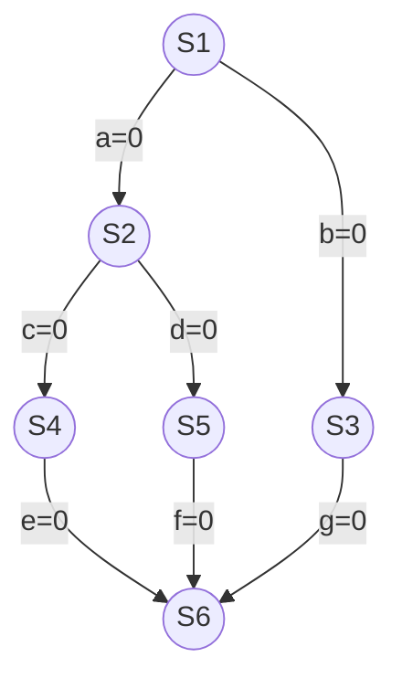

### Process sync by software

##### 单标志法

- 思想：两个进程在<span style="color:red">访问完临界区后</span>会把使用临界区的权限转交给另外一个进程。也就是说<span style="color:red">每个进程进入临界区的权限只能被另外一个进程赋予</span>。

  ```c
  // express admit enter critical section process number currently
  int turn = 0; 
  
  //p0 process
  while(turn != 0);
  critical section;
  turn = 1;
  remainder section;
  
  //p1 process
  while(turn != 1);
  critical section;
  turn = 0;
  remainder section;
  ```

  - 问题：<span style="color: red">单标志法</span>存在的主要问题是：<span style="color: red">违背“空闲让进”原则</span>

##### 双标志先检查法

- 思想：设置一个bool 数组 flag[ ]，数组中各个元素用来<span style="color: red">标记各进程想进入临界区的意愿</span>

  ```c
  bool flag[2];
  flag[0] = false;
  flag[1] = false;
  
  //p0 process
  while(flag[1]);
  flag[0] = true;
  critical section;
  flag[0] = false;
  remainder section;
  
  //p1 process
  while(flag[0]);
  flag[1] = true;
  critical section;
  flag[1] =false;
  remainder section;
  ```

  - 问题：双标志先检查法的<span style="color: red">主要问题</span>是：<span style="color: red">违反了“忙则等待”原则</span>。原因在于，<span style="color:red">进入区</span>的“检查”和“上锁”，<span style="color:red">两个处理不是一气呵成的</span>

##### 双标志后检查法

- 思想：先上锁、后检查

  ```c
  bool flag[2];
  flag[0] = false;
  flag[1] = false;
  
  //p0 process
  flag[0] = true;
  while(flag[1]);
  critical section;
  flag[0] = false;
  remainder section;
  
  //p1 process
  flag[1] = true;
  while(flag[0]);
  critical section;
  flag[1] =false;
  remainder section;
  ```

  - 问题：双标志后检查法虽然<span style="color:red">解决了"忙则等待"</span>的问题，但是<span style="color:red">又违背了“空闲让进”和“有限等待”原则</span>，会因各进程都长期无法访问临界资源而<span style="color:red">产生“饥饿”</span>现象

##### Peterson 算法

- 思想：双标志后检查法中，两个进程都争着想进入临界区，但是谁也不让谁，最后谁都无法进入临界区。可以让进程尝试“孔融让梨”，主动让对方使用临界区。

  ```c
  bool flag[2];
  int turn = 0;
  
  //p0 process
  flag[0] = true;         //⓵
  turn = 1;				 				//②
  while(flag[1]&&turn==1);//③
  critical section;
  flag[0] = false;
  remainder section;
  
  //p1 process
  flag[1] = true;					//④
  turn = 0;								//⑤
  while(flag[0]&&turn==0);//⑥
  critical section;
  flag[1] = false;
  remainder section;
  ```

  ⓵②③④⑤⑥

  ⓵②④③⑤⑥

  ⓵②④⑤③⑥

  ⓵②④⑤⑥③

  ⓵④⑤⑥②③

  ⓵/④②⑤③⑥

  .....

  Peterson算法用软件方法解决了进程互斥问题<span style="color:red">遵循空闲让进、忙则等待、有限等待三个原则</span>，但是依然<span style="color:red">未遵循让权等待原则</span>。(没有提供阻塞排队机制)

###  Process sync by hardware

##### 中断屏蔽方法

```pro
...
关中断
临界区
开中断
...
```

- 优点：简单、高效
- 问题：不适用与多处理机，关中断指令只对关中断处理机有用。属于特权指令，不适用于用户进程。

##### TestAndSet

TS指令/TSL（TestAndSetLock）指令

TSL指令<span style="color:red">是用硬件来实现的</span>，执行过程不允许被中断，只能一气呵成。

```c
//variable lock mean is or not locked in critical section, lock=true means locked or else
bool *lock;
bool TestAndSet(bool *lock){
  bool old;
  old = *lock;
  *lock = true;
  return old;
}

while(TestAndSet(&lock));
critical section;
lock = false;
remainder section;
```

- 优点：相对于软件实现方法，TSL指令把“上锁”和“检查”操作用硬件的方式变成了一气呵成的原子操作。也适用于多处理机环境。
- 问题：不满足让权等待原则（暂时无法进入临界区的进程会占用CPU并循环执行TSL指令，从而导致忙等）

##### Swap

XCHG指令/Exchange指令

Swap指令<span style="color:red">是用硬件实现的</span>

```c
// swap two variables values
Swap(bool *a, bool *b){
  bool temp;
  temp = *a;
  *a = *b;
  *b = temp;
}

bool old = true;
while(old == true)
  Swap(&lock,&old);
critical section;
lock = false;
remainder section;
```

- 优点：相对于软件实现方法，Swap指令把“上锁”和“检查”操作用硬件的方式变成了一气呵成的原子操作。也适用于多处理机环境。
- 问题：不满足让权等待原则（暂时无法进入临界区的进程会占用CPU并循环执行Swap指令，从而导致忙等）

### 信号量机制

1，在双标志先检查法中，<span style="color:red">进入去的“检查”和“上锁”操作无法一气呵成</span>，从而导致两个进程有可能同时进入临界区的问题。

2，之前所有的解决方案都<span style="color:red">无法实现“让权等待”</span>。

信号量机制能很好解决进程互斥、进程同步问题。

用户进程可以通过使用操作系统提供的<span style="color:red">一对原语</span>来对<span syle="color:red">信号量</span>进行操作，从而很方便实现了进程互斥、进程同步。

<span style="color:red">信号量</span>其实就是一个变量（<span style="color:#0099CC">可以是一个整数、也可以是更复杂的记录型变量</span>），可以用一个信号量来<span style="color:red">表示系统中某种资源的数量</span>。

<span style="color:red">原语</span>是一种特殊程序段，其<span style="color:red">执行只能是一气呵成，不可能中断</span>。原语是<span style="color:red">关中断/开中断指令</span>实现的。
<span style="color:red">一对原语</span>：<span style="color:red">wait(S)</span>原语和<span style="color:red">signal(S)</span>原语。

wait、signal原语常<span style="color:red">简称为P、V操作</span>，wait(S)=P(S)、signal(S)=V(S)（来自两个荷兰语proberen和verhogen）

##### 整型信号量

用一个<span style="color:red">整型的变量</span>作为信号量，用来<span style="color:red">表示系统中某种资源的数量。</span>

与普通整型变量的区别：对信号量的操作只有三种，初始化、P、V操作。

```C
int S = 1;

void wait(int S){
  // check
  while(S <= 0);
  // lock
  S = S - 1;
}

void signal(int S){
  S = S + 1;
}

//PO 
...
wait(S);
use printer resource;
signal(S);
...
  
//P1
...
wait(S);
use printer resource;
signal(S);
...
  
//Pn 
...
wait(S);
use printer resource;
signal(S);
...
```

- 问题： 存在忙等问题

##### 记录型信号量

用记录型数据结构表示的信号量

```c
// define
typedef struct {
  int value;
  struct process *L;
} semaphore;

void wait(semaphore S) {
  S.value --;
  if(S.value < 0) {
    block(S.L);
  }
}

void signal(semaphore S) {
  S.value++;
  if(S.value <= 0){
    wakeUp(S.L);
  }
}

//p0 process
...
wait(S);
use printer;
signal(S);

//p2 process
...
wait(S);
use printer;
signal(S);

//p2 process
...
wait(S);
use printer;
signal(S);

//p3 process
...
wait(S);
use printer;
signal(S);
```

使用block原语使进程从运行态进入阻塞态，并把当前进程挂到信号量S的等待队列中（阻塞队列）

P(S)、V(S)这对原语可用于<span style="color:red">实现系统资源的“申请”和释放。</span>

- 优点：该机制<span style="color:red">遵循了“让权等待原则”</span>，不会出现忙等现象。

### 用信号量机制实现进程互斥、同步、前驱关系

##### 实现进程互斥

1，分析并发进程的关键活动，划定临界区。2，设置<span style="color:red">互斥信号量</span>mutex，<span style="color:red">初始值为1</span>。3，在临界区之前实行P(mutex)操作。4，在临界区之后实行V(mutex)操作。

```c
semaphore mutex = 1;

//p1 process
P1(){
  ...
  P(mutex);
  critical section;
  V(mutex);
  ...
}

//p2 process
P2(){
  ...
  P(mutex);
  critical section;
  V(mutex);
  ...
}
```

注意：对于<span style="color:red">不同的临界资源</span>需要<span style="color:red">设置不同的信号量。</span>

<span style="color:red">P(mutex)、V(mutex)操作必须是成对出现的</span>


##### 实现进程同步

进程同步、要让各个并发的进程按要求有序的进行

1，分析什么地方需要实现“同步关系”，即必须保证“一前一后”执行的两个操作。2，设置<span style="color:red">同步信号量S，初始值为0</span>。3，<span style="color:red">在“前操作”之后执行V(S)</span>。4，<span style="color:red">在“后操作”之前执行P(S)</span>。

```C
semaphore S = 0;

//p1 process
P1(){
  ...
  code one;
  code two;
  V(S);
  code three;
  ...
}

//p2 process
P2(){
  ...
  P(S);
  code four;
  code five;
  code six;
  ...
}
```


##### 实现进程的前驱关系



1，要<span style="color:red">为每一对前驱关系各设置一个同步变量</span>。2，<span style="color:red">在前操作之后对相应的同步变量执行V操作</span>。3，<span style="color:red">在后操作之前对相应同步变量执行P操作</span>。

```properties
a = V(a) -- P(a)
b = V(b) -- P(b)
c = V(c) -- P(c)
......
```

```c
//p1 process
P1(){
  ...
  S1;
  V(a);
  V(b);
  ...
}

//p2 process
P2(){
  ...
  P(a);
  S2;
  V(c);
  V(d);
  ...
}

......
//p6 process
P3(){
  ...
  P(e);
  P(f);
  P(g);
  S6;
  ...
}
```


### 生产者消费者问题


生产者、消费者共享一个<span style="color:red">初始为空、大小为n的缓冲区</span>。

只有<span style="color:red">缓冲区没满</span>时，生产者才能把产品放入缓冲区，否则必须等待。

只有<span style="color:red">缓冲区不空</span>时，消费者才能从中取出产品，否则必须等待。

缓冲区是临界资源，各进程必须<span style="color:red">互斥地访问</span>。

PV操作题目分析步骤

1、关系分析。找出题目中描述的各个进程，分析他们之间的同步、互斥关系。

2、整理思路。根据各个进程的操作流程确定P、V操作的大致顺序。

3、设置信号量。设置需要的信号量，并根据题目条件确定信号量初始值。（互斥信号量初始值一般设置为1，同步信号量的初始值要看对应资源的初始值是多少）。

 ```c
 semaphore mutex = 1;
 semaphore empty = n;
 semaphore full = 0;
 
 //producer
 producer(){
   while(1){
     produce a good;
     P(empty);
     P(mutex);
     take good into cache area;
     V(mutex);
     V(full);
   }
 }
 
 //consumer
 consumer(){
   while(1){
     P(full);
     P(mutex);
     take good out from cache area;
     V(mutex);
     V(empty);
     use a good;
   }
 }
 ```

<span style="color:red">实现互斥的P操作一定要在实现同步的P操作之后</span>。

V操作不会造成进程阻塞，因此两个V操作顺序可以交换。


### 多生产者-多消费者问题

问题描述：大小为1，初始为空的缓冲区。

父亲：生产者进程1------🍊

母亲：生产者进程2------🍎

儿子：消费者进程1------🍊

女儿：消费者进程2------🍎

​                       										 🍊/🍎----🥘----🍊/🍎

互斥关系：

对缓冲区（盘子）的访问要互斥地进行

同步关系（一前一后）:

1，父亲将橘子放在盘子后，儿子才能取橘子

2，母亲将苹果放在盘子后，女儿才能取苹果

3，只有<span style="color:red">盘子为空</span>的，父母亲才能放入水果。

```c
semaphore mutex = 1;
semaphore orange = 0;
semaphore apple = 0;
semaphore plate = 1;

dad(){
  ready an orange;
  P(plate);
  P(mutex);
  take orange in plate;
  V(mutex);
  V(orange);
}

son(){
  P(orange);
  P(mutex);
  fetch orange from plate;
  V(mutex);
  V(plate);
  eat orange;
}

mom(){
  ready an apple;
  P(plate);
  P(mutex);
  take apple in plate;
  V(mutex);
  V(orange);
}

daughter(){
  P(apple);
  P(mutex);
  fetch apple from plate;
  V(mutex);
  V(plate);
  eat apple;
}
```

可以去掉mutex互斥信号量：本题的缓冲区大小为1，apple、orange、plate同一时刻最多只有一个变量为1 => 最多只有一个进程不会被阻塞。

### 吸烟者问题

假如一个系统有<span style="color:red">三个🚬者进程</span>和<span style="color:red">一个🤵进程</span>。每个吸烟者提供一种材料：烟草、纸、胶水

组合一：纸 + 胶水

组合二：烟草 + 胶水

组合三：烟草 + 纸

互斥关系：桌子要被互斥地访问

同步关系：

桌子上有组合一 -----> 第一个吸烟者取走东西

桌子上有组合二 -----> 第二个吸烟者取走东西

桌子上有组合三 -----> 第三个吸烟者取走东西

 发出完成信号    ------> 供应者将下一个组合放在桌上

```C
semaphore offer1 = 0;
semaphore offer2 = 0;
semaphore offer3 = 0;
semaphore finish = 0;
//for realizing turn to somke 
int i = 0;  
provider(){
  while(1){
    if(i == 0){
      take component one into desk;
      V(offer1);
    }else if(i == 1){
      take component two into desk;
      V(offer2);
    }else if(i == 2){
      take componet three into desk;
      V(offer3);
    }
    i = (i+1) % 3;
    P(finish);
  }
}

somker1(){
  P(offer1);
  fetch componet one from desk then somking;
  V(finish);
}

smoker2(){
  P(offer2);
  fetch componet two from desk then somking;
  V(finish);
}

smoker3(){
  P(offer3);
  fetch componet three from desk then somking;
  V(finish);
}
```


###  读者-写者问题

① <span style="color:red">允许多个读者可以同时对文件进行读操作</span>。

② <span style="color:red">只允许一个写者往文件里写数据</span>。

③ <span style="color:red">任何一个写者在写操作完成之前不允许其他读者或者写者工作</span>。

④ <span style="color:red">写者在执行写操作之前，应让已有的读者、写者全部退出</span>。

两类进程：读进程、写进程

互斥关系：写-写、写-读。

-- 读进程优先，写进程饥饿

```C
semaphore rw = 1;
//record how many reader process current
int count = 0;
semaphore mutex = 1;

writer(){
  P(rw);
  write file;
  V(rw);
}

reader(){
  P(mutex);
  if(count == 0){
    P(rw);
  }
  count ++;
  V(mutex);
  read file;
  P(mutex);
  count --;
  if(count == 0){
    V(rw);
  }
  V(mutex);
}
```

-- 写进程优先（读写公平法）

```C
semaphore rw = 1;
int count = 0;
semaphore mutex = 1;
// for writer advance
semaphore w = 1; 

writer(){
  P(w);
  P(rw);
  write file;
  V(rw);
  V(w);
}

reader(){
  P(w);
  P(mutex);
  if(count == 0){
    P(rw);
  }
  count ++;
  V(mutex); 
  V(w);
  read file;
  P(mutex);
  count --;
  if(count == 0){
    V(rw);
  }
}
```

分析并发执行P(w)情况：

读1-->读2

写1-->读2

写1-->读1

读1-->写1-->读2

写1-->读1-->写2

<span style="color:red">核心思想</span>是设置了<span style="color:red">一个计数器count</span>


### 哲学家进餐问题

1、关系分析：5个哲学家进程，5个相邻的哲学家之间拿起筷子是互斥关系。

2，整理思路：每个哲学家进程需要同时持有两个临界资源才能开始吃饭。如何<span style="color:red">避免</span>临界资源分配不当造成死锁现象。是哲学家问题的精髓。

3，信号量设置：定义互斥信号量数组chopstick[5]={1,1,1,1,1}，哲学家按顺序编号0～4，哲学家左边的筷子编号定为i，右边筷子编号定为（i+1）% 5。

-- no proper scheme

```C
semaphore chopstick[5] = {1,1,1,1,1};
// number i philosopher
Pi(){
  while(1){
    P(chopstick[i]);
    P(chopstick[(i + 1) % 5]);
    eat;
    V(chopstick[i]);
    V(chopstick[(i + 1) % 5]);
    think;
  }
}
```

-- 至多允许四个哲学家同时进餐

```C
semaphore chopstick[5] = {1,1,1,1,1};
semaphore count = 4
// number i philosopher
Pi(){
  while(1){
    P(count);
    P(chopstick[i]);
    P(chopstick[(i + 1) % 5]);
    eat;
    V(chopstick[i]);
    V(chopstick[(i + 1) % 5]);
    V(count);
    think;
  }
}
```


-- 奇数号哲学家先拿左边的筷子，然后再拿右边的筷子，偶数号相反

```C
semaphore chopstick[5] = {1,1,1,1,1};
// number i philosopher
Pi(){
  while(1){
    if(i % 2 == 0){
      P(chopstick[(i + 1) % 5]);
      P(chopstick[i]);
      eat;
      V(chopstick[(i + 1) % 5]);
      V(chopstick[i]);
      think;
    }else{
      P(chopstick[i]);
      P(chopstick[(i + 1) % 5]);
      eat;
      V(chopstick[i]);
      V(chopstick[(i + 1) % 5]);
      think;
    }
  }
 }
```


-- 仅当一个哲学家左右两支筷子都可用时才允许他抓起筷子

```c
semaphore chopstick[5] = {1,1,1,1,1};
semaphore mutex = 1;
// number i philosopher
Pi(){
  while(1){
    P(mutex);
    P(chopstick[i]);
    P(chopstick[(i + 1) % 5]);
    V(mutex);
    eat;
    V(chopstick[i]);
    V(chopstick[(i + 1) % 5]);
    think;
  }
}
```

